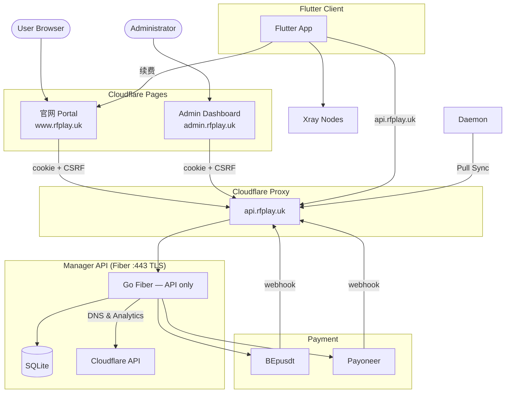
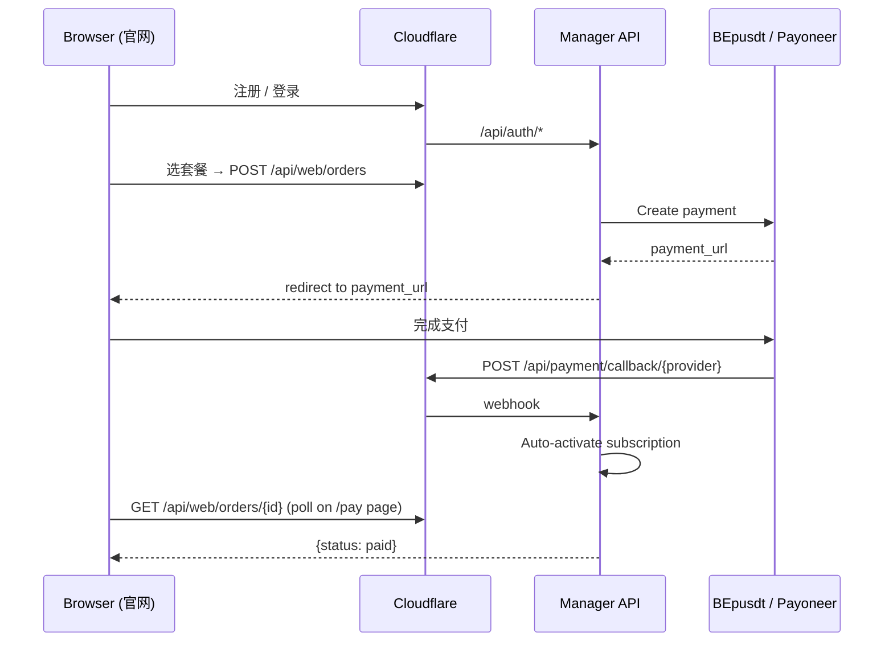
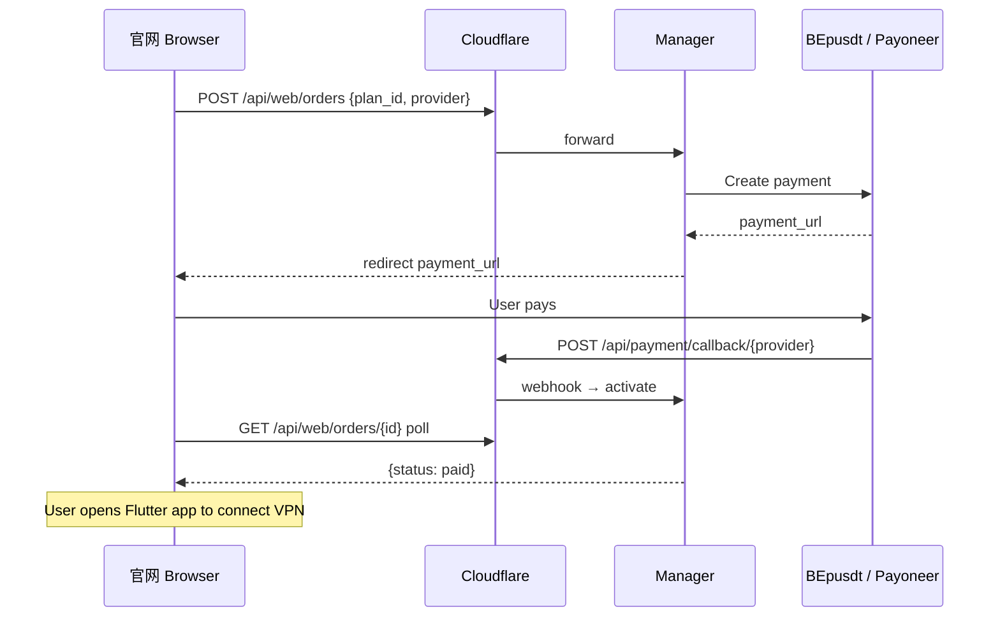
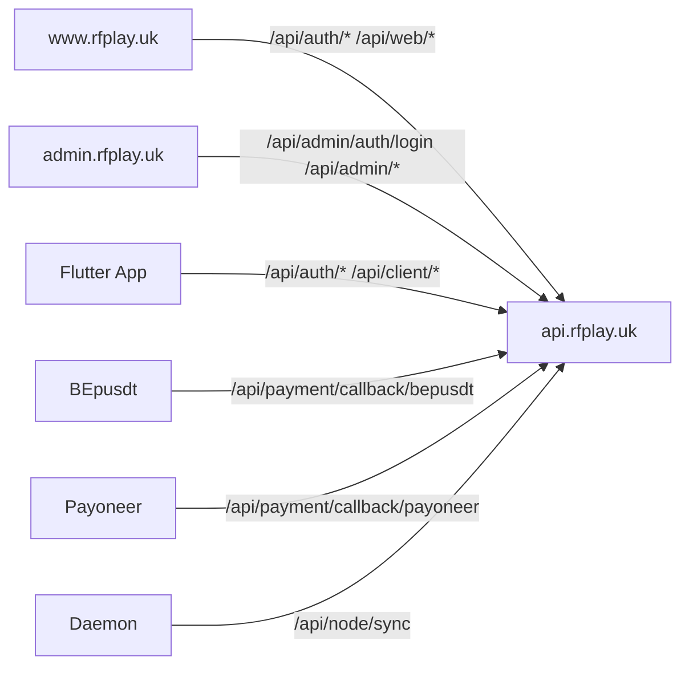
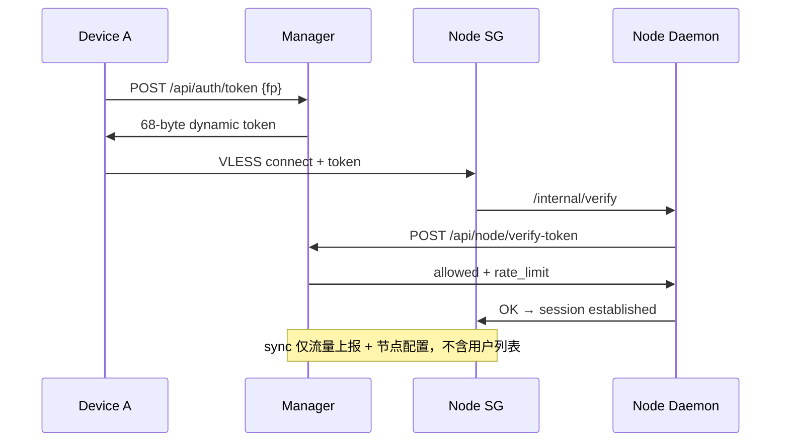
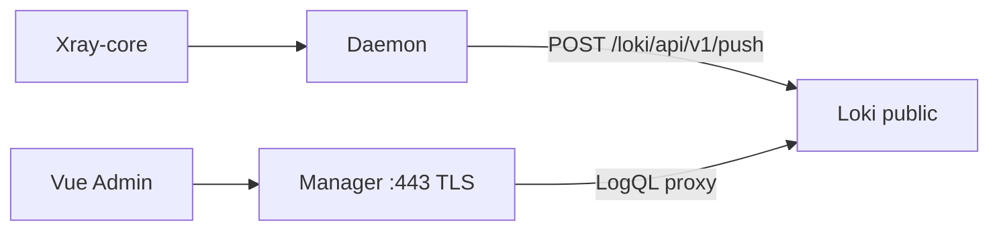

# Airport Proxy System Architecture Design Plan

This document outlines the detailed system architecture, database schema, API contracts, and integration flows for a modern, secure, and multi-platform proxy service ("Airport") featuring:
* A Go **Fiber** **API backend** (Manager); **User Portal** and **Admin Dashboard** deployed as separate **Cloudflare Pages** sites.
* Dynamic **Cloudflare API** DNS (proxy-enabled) and analytics integration.
* A **Pull-based** node daemon sync protocol with automated rotation.
* A modified **`XTLS/Xray-core`** with **Manager online verify** per connection (§4.1.1).
* **User Portal** (`www.rfplay.uk`): Vue 3, **httpOnly cookie + CSRF**（§4.2.1）.
* **Admin** (`admin.rfplay.uk`): 同上，独立 cookie 名.
* **Flutter** App: 账号登录 / Token 导入（`rf_`/`at_`）；JWT Bearer + `X-Client: flutter`（§4.2.2）.
* **Dual-mode nodes**: CF-WS（Nginx 伪装站 + WS 反代）与 REALITY 直连；连接时 **Manager 在线 verify-token**（§4.1.1）.
* Per-user **traffic accounting, rate limiting, and auto-expiry**.

---

## 1. System Architecture Overview



**Key split**:
* **官网 Portal** (`www.rfplay.uk`) — Cloudflare Pages：客户注册、登录、购套餐、支付。
* **Admin** (`admin.rfplay.uk`) — Cloudflare Pages：管理员登录、后台管理。
* **Manager API** (`api.rfplay.uk`) — 纯 API，无前端 embed；支付 webhook、Daemon sync、Flutter API 均指向此域名。
* **Flutter**：API 走 `api.rfplay.uk`；续费跳转 `www.rfplay.uk/plans`。

### 1.2 Dual-Mode Node Architecture

| Feature | Type A: CF-WS Node | Type B: REALITY Node |
| :--- | :--- | :--- |
| **Transport** | VLESS over WebSocket/TLS | VLESS-REALITY-Vision + uTLS |
| **CDN Protection** | ✅ IP hidden behind Cloudflare | ❌ Direct IP exposed |
| **Anti-Blocking** | High (CF IP pool is hard to ban) | Very High (mimics normal TLS to target site) |
| **Dynamic Port** | ❌ Fixed (443/2053/8443 etc.) | ✅ Supports dynamic port rotation |
| **Latency** | Higher (CDN hop) | Lower (direct connection) |
| **uTLS Fingerprint** | N/A (TLS terminated at CF) | ✅ Custom Chrome/Firefox/Safari fingerprint |
| **Use Case** | Stable fallback, high-censorship regions | Low-latency, performance-sensitive users |

---

## 2. User Portal (官网)

### 2.1 Purpose

**Decided**: User Portal and Admin Dashboard are **separate Cloudflare Pages** projects. Manager is **API-only** (no `go:embed` frontend).

### 2.2 Portal Pages

| Page | Route | Description |
| :--- | :--- | :--- |
| 首页 | `/` | Landing, pricing overview |
| 注册 | `/register` | `POST /api/auth/register` |
| 登录 | `/login` | `POST /api/auth/login` |
| 套餐 | `/plans` | List plans, select provider (USDT / Card) |
| 结账 | `/checkout/{plan_id}` | Create order, redirect to payment |
| 支付中 | `/pay/{order_id}` | Poll order status, show QR/link |
| 支付结果 | `/pay/result` | Success / failed after provider redirect |
| `/account` | Subscription, traffic, **Client Token** copy/regenerate, order history |
| 我的设备 | `/account/devices` | List/delete devices (same API as client) |

### 2.3 Portal Checkout Flow



---

## 3. Flutter VPN Client

### 3.1 Key Modules

Flutter supports **two entry modes** (same post-auth flow after success):

| Mode | UI | API |
| :--- | :--- | :--- |
| **账号登录** | username + password | `POST /api/auth/login` |
| **Token 导入** | paste `rf_` or `at_` token | `POST /api/auth/token-login` |

1. **Auth** (§3.2): login or token import → JWT session; no in-app registration (link to 官网).
2. **Session validate**: auto on launch & pre-VPN connect via `/api/auth/validate`.
3. **Subscription**, **续费** (§3.3), **到期提醒**, **设备管理**, routing/VPN (unchanged).

**No payment UI in Flutter.**

### 3.1.1 Token Types (do not confuse)

| Name | Prefix | Lifetime | Source | Purpose |
| :--- | :--- | :--- | :--- | :--- |
| **Client Access Token** | `rf_` | Long (until user resets) | 官网用户中心 | 已注册用户 Flutter **Token 导入** |
| **Admin Issued Token** | `at_` | Admin-defined expire + traffic | Admin 后台生成 | **免注册**；自定义时长/流量；Flutter 直接导入 |
| **JWT** | — | 30d sliding + 90d refresh | After login/token-login | API session |
| **Dynamic Token** | 68-byte binary (Option B) | 5 min | `/api/auth/token` | Node VLESS connection auth |

Both `rf_` and `at_` use the **same** Flutter Token 导入 UI and `POST /api/auth/token-login`; Manager routes by prefix.

### 3.2 Token Import Login (Token 导入 — 免账号密码)

**Decided**: user pastes a long-lived access token — from **官网** (`rf_`) or **Admin 发放** (`at_`) — no username/password required.

#### Flutter login screen

```
┌─────────────────────────────────┐
│  [ 账号登录 ]  [ Token 导入 ]    │  ← Tab 切换
├─────────────────────────────────┤
│  Token 导入模式：                │
│  ┌───────────────────────────┐  │
│  │ rf_xxx 或 at_xxx ...      │  │  ← 粘贴框
│  └───────────────────────────┘  │
│  [ 连接 ]                        │
│  rf_: www.rfplay.uk/account     │
│  at_: 管理员发放，无需注册        │
└─────────────────────────────────┘
```

* Token saved in secure storage after success (Keychain / EncryptedSharedPreferences).
* Next launch: auto `token-login` if stored token exists (skip login screen).
* User can **退出** to clear token and switch account.

#### API (unified for `rf_` and `at_`)

```
POST /api/auth/token-login
Body: {
  "client_token": "rf_xxx | at_xxx",
  "device_fingerprint": "a1b2c3..."
}
```

| Prefix | Lookup | Account type |
| :--- | :--- | :--- |
| `rf_` | `users.client_token_hash` | Registered user (官网) |
| `at_` | `issued_tokens.token_hash` → linked `user_id` | **Token-only** (no portal account) |

| Result | Response |
| :--- | :--- |
| Success | `{ "access_token": "<JWT>", "refresh_token": "...", "user": {...} }` — same shape as `/api/auth/login` |
| Invalid / revoked token | `401 INVALID_CLIENT_TOKEN` |
| Pending subscription (`rf_` only) | `403 SUBSCRIPTION_PENDING` → 官网购买 |
| Expired (`at_` or `rf_`) | `403 SUBSCRIPTION_EXPIRED` |
| Device limit (on later `/api/auth/token`) | `403 DEVICE_LIMIT_EXCEEDED` |

Token-login **does not** skip subscription/device checks — only skips username/password.

#### `rf_` — 官网 Client Token

In **用户中心** (`/account`):

* Display masked token: `rf_abc1••••••••xyz9`
* **复制 Token** / **重新生成** (`POST /api/web/client-token/regenerate`)
* Warning: 「重新生成后旧 Token 立即失效，需在各设备重新导入」

On user activation (first payment), auto-generate `client_token` if absent.

#### `at_` — Admin Issued Token（免注册）

Admin creates vouchers in **Admin Dashboard → 发放 Token**; no 官网注册/支付流程.

**Create** (`POST /api/admin/tokens`) or **batch** (`POST /api/admin/tokens/batch`):

```json
{
  "duration_days": 30,
  "traffic_limit_bytes": 107374182400,
  "traffic_mode": "one_time",
  "traffic_reset_days": 30,
  "max_devices": 3,
  "subscription_tier": "pro",
  "rate_limit_bps": 0,
  "note": "线下客户 A"
}
```

| Field | Required | Description |
| :--- | :--- | :--- |
| `traffic_limit_bytes` | **Yes** | Must be > 0; **no unlimited** for `at_` |
| `traffic_mode` | Yes | `one_time` or `cycle` — see below |
| `traffic_reset_days` | If `cycle` | Reset interval in days (e.g. 30) |
| `max_devices` | Yes | `0` = **不限制**；`1–N` = 上限（默认 10） |
| `duration_days` / `expire_time` | One of | Account validity window |

**Traffic modes** (`at_` only — registered `rf_` users always follow plan cycle):

| Mode | Behavior |
| :--- | :--- |
| `one_time` | Quota for entire validity; `traffic_used_bytes` accumulates; **no auto reset**; exhausted → `suspended` until Admin adds traffic or extends |
| `cycle` | Same as registered users: reset `traffic_used_bytes` every `traffic_reset_days` from `traffic_period_start`; still bounded by `expire_time` |

Use **either** `duration_days` (from now) **or** absolute `expire_time` (Unix); **either** `traffic_limit_bytes` or `traffic_limit_gb`.

**Batch create** (`POST /api/admin/tokens/batch`):

```json
{
  "count": 50,
  "duration_days": 30,
  "traffic_limit_bytes": 53687091200,
  "traffic_mode": "one_time",
  "max_devices": 1,
  "note": "活动码批次-2026-06"
}
```

→ Returns `{ "batch_id", "tokens": [{ "id", "token": "at_xxx", ... }, ...] }` — plaintext **shown once**; Admin exports CSV.

**Response** (single create; plaintext shown **once**):

```json
{
  "id": "uuid",
  "token": "at_xxxxxxxxxxxxxxxxxxxxxxxxxxxxxxxxxxxx",
  "token_prefix": "at_ab12",
  "user_id": "uuid",
  "expire_time": 1782049000,
  "traffic_limit_bytes": 107374182400,
  "note": "线下客户 A"
}
```

Admin copies `at_xxx` to user → user pastes in Flutter → immediate VPN access.

**List / revoke / renew**:

* `GET /api/admin/tokens` — filter by status (`active` / `revoked` / `expired` / `suspended`), note, batch_id, date
* `GET /api/admin/tokens/{id}` — usage: traffic used, devices bound, expire, traffic_mode
* `POST /api/admin/tokens/{id}/revoke` — disable only (no replacement); old `at_` stops working
* `POST /api/admin/tokens/{id}/renew` — **续期唯一方式**：作废当前 `at_` → 生成新 `at_`（新时长/流量/模式）；plaintext **仅返回一次**

**Immutability (decided)**: Admin 发放的 `at_` **创建后不可修改**（无 `PATCH`）— 不能改 note、流量、时长、设备数。只能 **revoke** 或 **renew**（作废 + 新发，参数在新 token 上重新指定）。

**Renew** (`POST /api/admin/tokens/{id}/renew`):

```json
{
  "duration_days": 30,
  "traffic_limit_bytes": 107374182400,
  "traffic_mode": "one_time",
  "traffic_reset_days": 30,
  "max_devices": 3,
  "reset_traffic": true,
  "note": "续期-2026-07"
}
```

→ `{ "old_token_id": "...", "new_token": "at_yyy...", "new_token_id": "...", "user_id": "..." }`  
旧 `at_` 立即 `revoked`；`users` 配额/`expire_time` 按 body 更新；`reset_traffic: true` 时 `traffic_used_bytes = 0`。  
Admin 将新 `at_` 发给用户 → Flutter **重新导入**（或退出后粘贴新 token）。

**Renewal policy (decided)**: **作废 + 发新 `at_`** — 不沿用旧 token 字符串。续期、加流量、解除耗尽/到期，均走 `/renew`。

**Internal model**: each `at_` issuance auto-creates a **token-only** `users` row (renew **reuses** same `user_id`; devices bound to user remain unless Admin clears):

| Field | Value |
| :--- | :--- |
| `account_type` | `token_only` |
| `username` | `tok_<shortid>` (not used for login) |
| `password_hash` | random unusable hash |
| `subscription_status` | `active` |
| `expire_time`, `traffic_limit_bytes`, `max_devices`, … | from admin input |
| `traffic_mode` | `one_time` or `cycle` (on `issued_tokens`) |

No 官网账号；不可 `POST /api/auth/login` with password. Renewal/extension only via Admin.

**Flutter UX for `token_only`**:

* Show traffic + expiry as normal
* **续费** hidden or replaced with 「联系管理员续期」
* Expired / revoked / old token after renew: banner 「Token 已失效，请向管理员索取新 Token」→ 退回 Token 导入页
* Stored `at_` fails `token-login` after renew → prompt re-import (no auto-migration)

#### Database

```sql
-- Registered users: client token (rf_)
ALTER TABLE users ADD COLUMN account_type TEXT DEFAULT 'registered';  -- 'registered' | 'token_only'
-- client_token_hash, client_token_prefix, client_token_created_at (rf_ only)

-- Admin issued tokens (at_)
CREATE TABLE IF NOT EXISTS issued_tokens (
    id TEXT PRIMARY KEY,
    user_id TEXT NOT NULL,
    token_hash TEXT UNIQUE NOT NULL,
    token_prefix TEXT NOT NULL,
    traffic_mode TEXT NOT NULL DEFAULT 'one_time',
    traffic_reset_days INTEGER,
    batch_id TEXT,
    renewed_from_id TEXT,                       -- previous issued_tokens.id (audit chain)
    status TEXT DEFAULT 'active',
    note TEXT,
    created_by TEXT,
    created_at INTEGER NOT NULL,
    revoked_at INTEGER,
    FOREIGN KEY(user_id) REFERENCES users(id) ON DELETE CASCADE,
    FOREIGN KEY(renewed_from_id) REFERENCES issued_tokens(id)
);
-- At most one active token per user_id (enforced in application layer or partial unique index)
```

Store **hash only**; plaintext `rf_` / `at_` shown once on generate.

### 3.3 Renewal Button & Expiry Reminders

**Decided**: Flutter provides **续费** entry points that open the **官网** in the system browser (`url_launcher`). Payment stays on the web.

#### Renewal button (续费)

| Location | Visibility | Action |
| :--- | :--- | :--- |
| **Home** (main screen) | Registered only | Tap **续费** → open `{portal_url}/plans` |
| **Account / Settings** | Subscription section | Show `expire_time`, traffic remaining + **续费** button |
| **Pending banner** | `subscription_status = pending` | **前往官网购买** → `/plans` |
| **Expired banner** | `expired` or past `expire_time` | Registered: **前往官网续费** → `/plans`; `token_only`: **联系管理员** |

`portal_url` from `GET /api/client/config` or `POST /api/auth/validate` response (e.g. `https://www.rfplay.uk`).

#### Expiry reminders (到期提醒)

Trigger based on `expire_time` from validate/subscription (only when `subscription_status = active`):

| Days until expiry | In-app | Local notification |
| :--- | :--- | :--- |
| **≤ 7 days** | Yellow banner on home:「套餐将在 N 天后到期」+ **续费** | Once per day max |
| **≤ 3 days** | Orange banner:「套餐即将到期，请及时续费」+ **续费** | Daily |
| **≤ 1 day** | Red banner:「套餐明天到期」+ **续费** | Daily |
| **Expired** | Red full-width block; VPN connect disabled | Once on expiry |

* Check timing: on app launch, after `validate`, and every **6 hours** while app in background (platform `WorkManager` / iOS background fetch).
* Notification tap → open `{portal_url}/plans`.
* User can dismiss banner for current session; re-show on next launch if still within threshold.

#### Home screen layout (续费入口)

```
┌─────────────────────────────────┐
│  [连接状态]          [续费]     │  ← 右上角常驻续费按钮
├─────────────────────────────────┤
│  ⚠ 套餐将在 3 天后到期  [续费]   │  ← 到期提醒横幅（§3.3 阈值）
├─────────────────────────────────┤
│  节点列表 / 连接按钮             │
└─────────────────────────────────┘
```

**Validate response extension** (`POST /api/auth/validate`):
```json
{
  "access_token": "...",
  "user": {
    "subscription_status": "active",
    "subscription_tier": "pro",
    "expire_time": 1782049000,
    "days_until_expire": 5,
    "traffic_remaining_bytes": 53687091200,
    "renewal_url": "https://www.rfplay.uk/plans"
  }
}
```

### 3.4 Device Manager UI (Flutter)

**Decided**: client shows device binding status; user self-manages devices.

* Entry: **Settings → 我的设备**
* Header: `已绑定 3 / 10 台` when `max_devices > 0`; `已绑定 3 台（不限）` when `max_devices = 0`
* List each device:

  | Field | Source |
  | :--- | :--- |
  | Name | `device_name` (auto: "Pixel 8 / Android 14") or user-editable |
  | Platform | `platform` |
  | Last seen | `last_seen` relative time |
  | Current | `is_current: true` badge on this device |

* Actions:
  * Tap device → **解除绑定** → confirm dialog → `DELETE /api/client/devices/{id}`
  * If deleting current device: warn "当前设备将被移除，需重新获取连接权限"; after delete, force re-token on next connect
  * When `max_devices > 0` and `used >= max_devices` on new device: show list with prompt to remove one before retry

* **API response** (`GET /api/client/devices`):
  ```json
  {
    "max_devices": 10,
    "used": 3,
    "devices": [
      {
        "id": 1,
        "device_name": "Pixel 8",
        "platform": "android",
        "last_seen": 1782049000,
        "is_current": true
      }
    ]
  }
  ```

### 3.5 Xray-core Client Config Generation (Pseudocode)
The Flutter client dynamically generates a local Xray config JSON:
```json
{
  "routing": {
    "domainStrategy": "IPIfNonMatch",
    "rules": [
      {
        "type": "field",
        "domain": ["geosite:cn"],
        "outboundTag": "direct"
      },
      {
        "type": "field",
        "ip": ["geoip:cn", "geoip:private"],
        "outboundTag": "direct"
      },
      {
        "type": "field",
        "port": "0-65535",
        "outboundTag": "proxy-balancer"
      }
    ],
    "balancers": [
      {
        "tag": "proxy-balancer",
        "selector": ["node-sg-01", "node-jp-02"],
        "strategy": { "type": "leastPing" }
      }
    ]
  },
  "outbounds": [
    {
      "tag": "node-sg-01",
      "protocol": "vless",
      "settings": { "vnext": [{ "address": "node-sg-01.mycdn.com", "port": 443 }] },
      "streamSettings": {
        "network": "ws",
        "wsSettings": {
          "path": "/ws",
          "headers": { "X-Dynamic-Token": "<Base64URL_Token>" }
        },
        "security": "tls"
      },
      "mux": { "enabled": true, "concurrency": 8, "idleTimeout": 90 }
    },
    {
      "tag": "node-jp-02",
      "protocol": "vless",
      "settings": { "vnext": [{ "address": "103.x.x.x", "port": 18293, "flow": "xtls-rprx-vision" }] },
      "streamSettings": {
        "network": "tcp",
        "security": "reality",
        "realitySettings": {
          "serverName": "www.microsoft.com",
          "fingerprint": "chrome",
          "publicKey": "<ServerPublicKey>",
          "shortId": "<ShortId>"
        }
      }
    },
    {
      "tag": "direct",
      "protocol": "freedom"
    }
  ]
}
```

---

## 3. Database Schema Design (SQLite)

```sql
-- Users and Subscription info
CREATE TABLE IF NOT EXISTS users (
    id TEXT PRIMARY KEY,                       -- User UUID
    username TEXT UNIQUE NOT NULL,
    password_hash TEXT NOT NULL,                -- unusable random hash for account_type=token_only
    account_type TEXT DEFAULT 'registered',     -- 'registered' | 'token_only' (admin at_ token)
    subscription_tier TEXT DEFAULT 'basic',     -- 'basic', 'pro', 'unlimited'
    subscription_status TEXT DEFAULT 'pending', -- 'pending', 'active', 'expired', 'suspended'
    traffic_limit_bytes INTEGER,                -- NULL until plan assigned / admin token created
    traffic_used_bytes INTEGER DEFAULT 0,
    rate_limit_bps INTEGER DEFAULT 0,
    max_devices INTEGER DEFAULT 10,
    traffic_period_start INTEGER,               -- NULL until activated
    expire_time INTEGER,
    client_token_hash TEXT UNIQUE,              -- SHA256 of rf_xxx (registered users only)
    client_token_prefix TEXT,                   -- Display prefix, e.g. "rf_abc1"
    client_token_created_at INTEGER,
    created_at INTEGER NOT NULL,
    updated_at INTEGER NOT NULL
);

-- Admin issued access tokens (at_xxx) — no registration required
CREATE TABLE IF NOT EXISTS issued_tokens (
    id TEXT PRIMARY KEY,
    user_id TEXT NOT NULL,
    token_hash TEXT UNIQUE NOT NULL,
    token_prefix TEXT NOT NULL,
    traffic_mode TEXT NOT NULL DEFAULT 'one_time',
    traffic_reset_days INTEGER,
    batch_id TEXT,
    renewed_from_id TEXT,
    status TEXT DEFAULT 'active',
    note TEXT,
    created_by TEXT,
    created_at INTEGER NOT NULL,
    revoked_at INTEGER,
    FOREIGN KEY(user_id) REFERENCES users(id) ON DELETE CASCADE,
    FOREIGN KEY(renewed_from_id) REFERENCES issued_tokens(id)
);

-- Device Registry (see §6.1 for fingerprint definition)
CREATE TABLE IF NOT EXISTS user_devices (
    id INTEGER PRIMARY KEY AUTOINCREMENT,
    user_id TEXT NOT NULL,
    device_fingerprint TEXT NOT NULL,           -- SHA256 hex (first 32 chars), see §6.1
    device_name TEXT,                           -- Optional friendly label from client
    last_seen INTEGER,
    created_at INTEGER NOT NULL,
    FOREIGN KEY(user_id) REFERENCES users(id) ON DELETE CASCADE,
    UNIQUE(user_id, device_fingerprint)
);

-- Proxy Nodes (supporting both CF-WS and REALITY types)
CREATE TABLE IF NOT EXISTS nodes (
    id TEXT PRIMARY KEY,                        -- Node UUID
    name TEXT NOT NULL,
    node_type TEXT NOT NULL,                    -- 'cf-ws' or 'reality'
    node_ip TEXT NOT NULL,                      -- Node's actual server IP
    node_port INTEGER DEFAULT 443,             -- Listening port
    -- CF-WS specific fields
    subdomain TEXT,                             -- e.g., node-01.mycdn.com (CF-WS only)
    cloudflare_dns_id TEXT,                     -- CF DNS record ID (CF-WS only)
    -- REALITY specific fields
    reality_dest TEXT,                          -- e.g., "www.microsoft.com:443"
    reality_server_names TEXT,                  -- JSON array of SNI values
    reality_private_key TEXT,                   -- X25519 private key (stored encrypted)
    reality_public_key TEXT,                    -- X25519 public key (distributed to clients)
    reality_short_ids TEXT,                     -- JSON array of short IDs
    utls_fingerprint TEXT DEFAULT 'chrome',     -- uTLS fingerprint: chrome, firefox, safari, random
    dynamic_port_range TEXT,                    -- e.g., "10000-60000" (REALITY only)
    -- Common fields
    region TEXT,                                -- Geographic region label
    node_token TEXT UNIQUE NOT NULL,            -- Shared token for Daemon Authentication
    status TEXT DEFAULT 'offline',              -- 'online', 'offline'
    max_users INTEGER DEFAULT 200,
    last_sync INTEGER
);

-- Traffic Audit Logs (for Cloudflare cross-validation)
CREATE TABLE IF NOT EXISTS traffic_logs (
    id INTEGER PRIMARY KEY AUTOINCREMENT,
    user_id TEXT NOT NULL,
    node_id TEXT NOT NULL,
    bytes_sent INTEGER DEFAULT 0,
    bytes_received INTEGER DEFAULT 0,
    recorded_at INTEGER NOT NULL,
    FOREIGN KEY(user_id) REFERENCES users(id),
    FOREIGN KEY(node_id) REFERENCES nodes(id)
);

-- Settings Table
CREATE TABLE IF NOT EXISTS settings (
    key TEXT PRIMARY KEY,
    value TEXT NOT NULL
);

-- Subscription plan catalog (Admin CRUD)
CREATE TABLE IF NOT EXISTS subscription_plans (
    id TEXT PRIMARY KEY,
    name TEXT NOT NULL,                         -- e.g., 'Pro 月付'
    tier TEXT NOT NULL,                         -- 'basic', 'pro', 'unlimited'
    traffic_limit_bytes INTEGER NOT NULL,
    rate_limit_bps INTEGER DEFAULT 0,
    duration_days INTEGER NOT NULL,             -- e.g., 30
    price_cents INTEGER NOT NULL,
    currency TEXT DEFAULT 'CNY',
    enabled INTEGER DEFAULT 1,
    sort_order INTEGER DEFAULT 0,
    created_at INTEGER NOT NULL
);

-- Payment orders
CREATE TABLE IF NOT EXISTS payment_orders (
    id TEXT PRIMARY KEY,
    user_id TEXT NOT NULL,
    plan_id TEXT NOT NULL,
    amount_cents INTEGER NOT NULL,
    currency TEXT NOT NULL,
    status TEXT DEFAULT 'pending',              -- 'pending', 'paid', 'failed', 'refunded'
    provider TEXT NOT NULL,                     -- 'bepusdt' | 'payoneer'
    provider_order_id TEXT,                     -- third-party transaction id
    idempotency_key TEXT UNIQUE NOT NULL,
    paid_at INTEGER,
    created_at INTEGER NOT NULL,
    FOREIGN KEY(user_id) REFERENCES users(id),
    FOREIGN KEY(plan_id) REFERENCES subscription_plans(id)
);
```

---

## 4. Control Plane API Contracts

### 4.1 Node Daemon Sync (Pull Endpoint)

**Decided**: sync **仅**上报流量与拉取节点配置 — **不再**下发 `hmac_secret` / `user_list`（防节点被攻破后全量用户泄漏）。

* **URL**: `POST /api/node/sync`
* **Headers**: `X-Node-Token: <Node_Token>`
* **Request**:
  ```json
  {
    "node_id": "uuid",
    "system_load": 0.45,
    "active_connections": 128,
    "traffic_reports": [
      { "user_id": "uuid", "bytes_sent": 1048576, "bytes_received": 524288, "period_start": 1782049000 }
    ]
  }
  ```
* **Response**:
  ```json
  {
    "status": "success",
    "dynamic_port": 28431,
    "p2p_audit": { "enabled": true },
    "cert_expires_at": 1782049000
  }
  ```

### 4.1.1 Node Online Token Verification (Decided)

**Decided**: 用户发起连接时，**节点向 Manager 实时验证** dynamic token — 不在节点存用户列表或 HMAC secret。

* **URL**: `POST /api/node/verify-token`
* **Headers**: `X-Node-Token: <Node_Token>`
* **Body**:
  ```json
  {
    "node_id": "uuid",
    "dynamic_token_b64": "Base64URL(68-byte token)",
    "client_ip": "1.2.3.4"
  }
  ```
* **Response (allow)**:
  ```json
  {
    "allowed": true,
    "user_id": "uuid",
    "rate_limit_bps": 10485760,
    "subscription_tier": "pro",
    "cache_ttl_sec": 60
  }
  ```
* **Response (deny)**: `{ "allowed": false, "reason": "EXPIRED|REVOKED|BAD_SIG|REPLAY|TRAFFIC_EXCEEDED" }`

**Call chain**:
```
Client → Xray inbound (dynamic token in WS header / VLESS addon)
       → Daemon localhost POST /internal/verify
       → (cache miss) Manager POST /api/node/verify-token
       → allow → Xray 建立会话（rate_limit 来自 verify 响应）
```

**Node-side cache**: Daemon 缓存 `SHA256(token) → {user_id, rate_limit_bps, exp}`，TTL = `min(cache_ttl_sec, token remaining TTL)`，默认 60s。同一 token 重连命中缓存，减轻 Manager 压力。

**Manager-side checks** (single source of truth):
1. HMAC-SHA256 valid（current / previous secret，5h 轮换 + 30min overlap）
2. `issued_at + 300s >= now()`
3. **Nonce 未重放**（Manager 强制；非 optional）
4. User `subscription_status = active`，未超 `traffic_limit`，未过 `expire_time`
5. Device fingerprint 已注册（发证时已校验；verify 可二次确认）

**Revoke / 过期生效**: 下一次连接 verify 立即拒绝 — **优于**旧方案等 60s sync。

**Latency mitigation**: 节点↔Manager 走内网/同区域部署；verify 超时默认 2s，超时拒绝连接（fail closed）。

### 4.2 Auth API — Portal vs Flutter

**Decided**: 官网/Admin 与 Flutter **共用** login 端点，Manager 按 `X-Client: flutter` 区分响应格式。

#### 4.2.1 官网 & Admin — httpOnly Cookie + CSRF（Decided）

| Endpoint | Auth | Response |
| :--- | :--- | :--- |
| `GET /api/auth/csrf` | Public | Sets `csrf` cookie if absent; `{ "ok": true }` |
| `POST /api/auth/register` | Public | `{ "user": {...} }` + Set-Cookie（验证邮箱后或注册即登录，见邮件流） |
| `POST /api/auth/login` | Public | `{ "user": {...} }` — **无** `access_token` in body |
| `POST /api/auth/logout` | Cookie | Clears `session`, `refresh`, `csrf` |
| `POST /api/auth/refresh` | `refresh` cookie | Rotates `session` cookie |
| `POST /api/auth/validate` | Cookie | `{ "user": {...}, "days_until_expire", "renewal_url" }` |

**Cookies** (`Domain=.rfplay.uk`; Portal 与 Admin 用 **不同 cookie 名**):

| Cookie | HttpOnly | Purpose |
| :--- | :--- | :--- |
| `session` / `admin_session` | ✅ | Access JWT（30d sliding） |
| `refresh` / `admin_refresh` | ✅ | Refresh JWT（90d） |
| `csrf` / `admin_csrf` | ❌ | CSRF double-submit；JS 可读，放 `X-CSRF-Token` header |

**Set-Cookie 示例**（`POST /api/auth/login`，官网）:
```
Set-Cookie: session=<JWT>; HttpOnly; Secure; SameSite=Strict; Path=/; Domain=.rfplay.uk; Max-Age=2592000
Set-Cookie: refresh=<JWT>; HttpOnly; Secure; SameSite=Strict; Path=/; Domain=.rfplay.uk; Max-Age=7776000
Set-Cookie: csrf=<random>; Secure; SameSite=Strict; Path=/; Domain=.rfplay.uk; Max-Age=2592000
```

**CSRF 规则**（Manager middleware，`/api/web/*` + `/api/auth/logout|refresh`）:
* **Safe methods** (`GET`, `HEAD`, `OPTIONS`): 不校验 CSRF
* **State-changing** (`POST`, `PUT`, `PATCH`, `DELETE`): 要求 header `X-CSRF-Token` === `csrf` cookie
* Mismatch → `403 CSRF_INVALID`

**CORS**（Fiber）:
```go
AllowOrigins:  []string{"https://www.rfplay.uk", "https://admin.rfplay.uk"},
AllowCredentials: true,
AllowHeaders:  "Content-Type, X-CSRF-Token, X-Client",
```

**Vue 官网**（`portal/`）:
```javascript
// axios defaults
axios.defaults.baseURL = import.meta.env.VITE_API_BASE_URL
axios.defaults.withCredentials = true
axios.interceptors.request.use(cfg => {
  if (['post','put','patch','delete'].includes(cfg.method)) {
    cfg.headers['X-CSRF-Token'] = readCookie('csrf')
  }
  return cfg
})
// App mount: GET /api/auth/csrf
```

**`/api/web/*`**：鉴权从 **`session` cookie** 解析 JWT — **不用** `Authorization: Bearer`。

#### 4.2.2 Flutter — JWT Bearer（不变）

请求带 header：`X-Client: flutter`

| Endpoint | Response |
| :--- | :--- |
| `POST /api/auth/login` | `{ "access_token", "refresh_token", "user" }` — **无** Set-Cookie |
| `POST /api/auth/token-login` | 同上 |
| `POST /api/auth/validate` | `Authorization: Bearer <JWT>` |
| `POST /api/auth/token` | Bearer + `device_fingerprint` → 68-byte dynamic token |

Token 存 Keychain / EncryptedSharedPreferences；**不用 cookie，不用 CSRF**。

#### 4.2.3 Shared

* **Dynamic token** (node): `POST /api/auth/token` — 68-byte Option B；Flutter Bearer session + `device_fingerprint`.

### 4.3 Web Portal API (官网 — 注册/购套餐/支付)

**Decided**: payment APIs are Manager endpoints; 官网 is the UI front-end calling them.

* **List plans**: `GET /api/web/plans` (public, no auth).
* **Create order**: `POST /api/web/orders` — **session cookie** + CSRF header
  ```json
  { "plan_id": "uuid", "provider": "bepusdt" }
  ```
  → `{ "order_id", "provider", "payment_url", "status": "pending" }`
  → Portal redirects browser to `payment_url`.

* **Order status** (poll on `/pay/{order_id}`): `GET /api/web/orders/{id}`

* **Order history**: `GET /api/web/orders` (user's past orders)

* **Account summary**: `GET /api/web/account` — tier, traffic, expire, status, masked client token.

* **Client Access Token** (官网用户中心):
  * `GET /api/web/client-token` — masked prefix + created_at
  * `POST /api/web/client-token/regenerate` — new `rf_xxx` (shown once in response)

* **Device management** (官网用户中心 or Flutter):
  * `GET /api/client/devices` — 官网：cookie；Flutter：Bearer
  * `DELETE /api/client/devices/{id}` — 官网：cookie + CSRF；Flutter：Bearer

* **Payment webhook** → auto-activate (see §4.5).

### 4.4 Flutter VPN Client API

* **Config** (optional bootstrap): `GET /api/client/config` — public, no auth.
  ```json
  { "portal_url": "https://www.rfplay.uk", "renewal_path": "/plans" }
  ```

* **Subscription**: `GET /api/client/subscription` — requires `active`.
  * `403 SUBSCRIPTION_PENDING` → Flutter opens 官网 `/plans` in browser.
  * `403 SUBSCRIPTION_EXPIRED` → Flutter opens 官网 `/plans` for renewal.
* No `/api/web/plans` or `/api/web/orders` on Flutter.

**Subscription response** (`GET /api/client/subscription`):
  * **Headers**: `Authorization: Bearer <JWT>`
  ```json
  {
    "user": {
      "id": "uuid",
      "tier": "pro",
      "traffic_remaining_bytes": 53687091200,
      "expire_time": 1782049000
    },
    "nodes": [ "..." ],
    "routing": {
      "geoip_url": "https://api.rfplay.uk/assets/geoip.dat",
      "geosite_url": "https://api.rfplay.uk/assets/geosite.dat",
      "geoip_etag": "abc123",
      "geosite_etag": "def456"
    },
    "subscription_version": 42
  }
  ```

### 4.5 Payment Callback & Auto-Activation

* **URL**: `POST /api/payment/callback/{provider}` (`bepusdt` | `payoneer`)
* Verify provider signature → **idempotent** activation.
* On success:
  ```go
  user.subscription_status = "active"
  user.subscription_tier = plan.tier
  user.traffic_limit_bytes = plan.traffic_limit_bytes
  user.rate_limit_bps = plan.rate_limit_bps
  user.traffic_used_bytes = 0
  user.traffic_period_start = now()
  user.expire_time = now() + plan.duration_days * 86400
  order.status = "paid"
  ```
* **Renewal** (already `active`): extend `expire_time`, reset traffic period.

### 4.6 Admin Bootstrap & Manual Override

**Super-admin creation** (first Manager startup):

```bash
airport-manager --init-admin --username admin --password '<secure>'
# or: AIRPORT_BOOTSTRAP_ADMIN_USER / AIRPORT_BOOTSTRAP_ADMIN_PASS
```

**Manual activation override** (Admin dashboard — for comp accounts, support, refunds):

```
PATCH /api/admin/users/{id}
{ "subscription_status": "active", "subscription_tier": "pro", ... }
```

**Plan catalog CRUD**: `CRUD /api/admin/plans` — defines purchasable packages linked to payment flow.

**Issued Token management** (免注册发放 — `at_`):

| Method | Endpoint | Description |
| :--- | :--- | :--- |
| `POST` | `/api/admin/tokens` | Create one token + synthetic `token_only` user |
| `POST` | `/api/admin/tokens/batch` | Batch create N tokens (same params); export once |
| `GET` | `/api/admin/tokens` | List tokens (status, note, batch_id, traffic, expire) |
| `GET` | `/api/admin/tokens/{id}` | Detail + bound devices |
| `POST` | `/api/admin/tokens/{id}/revoke` | Disable only (no new token) |
| `POST` | `/api/admin/tokens/{id}/renew` | **作废旧 `at_` + 发新 `at_`**（唯一变更方式；旧记录 immutable） |

### 4.7 Payment Providers — **Decided: BEpusdt + Payoneer**

Two payment channels; user selects at checkout on **官网**. Manager implements payment logic; portal is UI only.

| Provider | Method | 官网 UX |
| :--- | :--- | :--- |
| **BEpusdt** | USDT (multi-chain) | Browser redirect to BEpusdt cashier |
| **Payoneer** | Visa / Mastercard | Browser redirect to Payoneer hosted page |

```go
type PaymentProvider interface {
    Name() string                                          // "bepusdt" | "payoneer"
    CreatePayment(order *PaymentOrder) (paymentURL string, err error)
    VerifyCallback(r *http.Request) (*CallbackResult, error)
}
```

**Callback URLs** (HTTPS via Cloudflare → Manager `:443` Origin PEM):

| Provider | Endpoint |
| :--- | :--- |
| BEpusdt | `POST https://api.rfplay.uk/api/payment/callback/bepusdt` |
| Payoneer | `POST https://api.rfplay.uk/api/payment/callback/payoneer` |

#### 4.7.1 BEpusdt (USDT)

Self-hosted [BEpusdt](https://github.com/v03413/BEpusdt) gateway. Manager calls BEpusdt API to create transaction; BEpusdt pushes async notify on payment events.

**Create transaction** (Manager → BEpusdt):
```
POST {bepusdt_host}/api/v1/order/create-transaction
Authorization: Bearer {auth_token}
{
  "order_id": "<payment_orders.id>",
  "amount": "29.00",
  "notify_url": "https://api.rfplay.uk/api/payment/callback/bepusdt",
  "redirect_url": "https://www.rfplay.uk/pay/result?order_id=<id>"
}
```
→ Returns cashier `payment_url` stored in order.

**Webhook** (BEpusdt → Manager):
```json
{
  "order_id": "uuid",
  "amount": "29.00",
  "actual_amount": "29.00",
  "token": "USDT",
  "status": 2,
  "block_transaction_id": "0x...",
  "signature": "..."
}
```

| status | Meaning | Manager action |
| :--- | :--- | :--- |
| `1` | Waiting | No-op (or update order `pending`) |
| `2` | Paid | Verify signature → idempotent activate subscription |
| `3` | Expired | Mark order `failed` |

**Signature verification**: sort params (exclude `signature`), concat `key=value&...`, append `auth_token`, MD5 lowercase.

**Response**: HTTP `200` + body `ok` (required for status=2; BEpusdt retries on failure).

**Idempotency key**: `block_transaction_id` (on-chain tx) + `order_id`.

**Settings** (`settings` table): `bepusdt_host`, `bepusdt_auth_token`.

#### 4.7.2 Payoneer Checkout (Card)

[Payoneer Checkout](https://www.payoneer.com/checkout/) for Visa/Mastercard. Manager creates checkout session; 官网 redirects user to hosted payment page.

**Create checkout** (Manager → Payoneer):
```
POST {payoneer_api}/checkout/sessions
{
  "amount": { "value": "29.00", "currency": "USD" },
  "reference_id": "<payment_orders.id>",
  "return_url": "https://www.rfplay.uk/pay/result?order_id=<id>",
  "webhook_url": "https://api.rfplay.uk/api/payment/callback/payoneer"
}
```
→ Returns `payment_url`; 官网 `window.location.href = payment_url`.

**Webhook** (Payoneer → Manager): verify signature; on `payment.completed` → activate. Idempotency: `transaction_id`.

**Settings**: `payoneer_api_key`, `payoneer_merchant_id`, `payoneer_webhook_secret`.

#### 4.7.3 Shared Rules

* **Webhook + 官网轮询**: 用户从支付页跳回 `/pay/result` 后，页面轮询 `GET /api/web/orders/{id}` 每 2s，最多 30s。
* **Idempotent activation**: duplicate callbacks must not double-extend subscription.
* **Renewal**: active user re-purchases on 官网 → extend expire + reset traffic.



---

## 5. Per-User Rate Limiting (In-Core Token Bucket)

Rate limiting is implemented **inside the modified Xray-core** VLESS inbound handler, not at the OS network layer (which is unusable behind Cloudflare CDN).

### 5.1 Design
```go
// Each authenticated user session gets a token bucket limiter
type UserSession struct {
    UserID      string
    RateLimit   int64 // bytes per second, 0 = unlimited
    Bucket      *rate.Limiter
    BytesSent   int64
    BytesRecv   int64
}

// On each Read/Write in the proxied connection:
func (s *UserSession) RateLimitedWrite(data []byte) (int, error) {
    if s.RateLimit > 0 {
        // Wait for token bucket to allow len(data) bytes
        s.Bucket.WaitN(context.Background(), len(data))
    }
    atomic.AddInt64(&s.BytesSent, int64(len(data)))
    return s.upstream.Write(data)
}
```

### 5.2 Rate Limit Source

**Decided**: `rate_limit_bps` 在 **`/api/node/verify-token` 响应**中返回，Daemon 缓存后注入 Xray 会话。Admin 改用户限速后，**新连接**立即生效（缓存 TTL ≤ 60s）。

---

## 6. User Expiry, Traffic Reset & Device Limits

### 6.1 Device Fingerprint

**Definition**: a stable, client-generated identifier per physical device/installation:

```
device_fingerprint = SHA256(platform + os_version + device_model + app_install_uuid)[:32 hex]
```

| Component | Example |
| :--- | :--- |
| `platform` | `android`, `ios`, `windows`, `macos` |
| `os_version` | `14.0`, `23H2` |
| `device_model` | `Pixel 8`, `MacBookPro18,1` |
| `app_install_uuid` | Random UUID generated on first app launch, persisted in secure storage |

Flutter client computes this once at install time and sends it on register, login, and every `/api/auth/token` call.

### 6.2 Device Limit Enforcement

**Decided**: `max_devices = 0` means **unlimited** devices; `max_devices > 0` enforces cap at dynamic token issuance.

```
POST /api/auth/token
Authorization: Bearer <JWT>
Body: { "device_fingerprint": "a1b2c3..." }

→ fingerprint already registered        → issue token, update last_seen
→ fingerprint new, max_devices = 0      → register device, issue token (no cap)
→ fingerprint new, devices < max_devices → register device, issue token
→ fingerprint new, devices >= max_devices → 403 DEVICE_LIMIT_EXCEEDED
```

Node Xray-core **does not** validate HMAC locally — delegates to Daemon → Manager `verify-token`. Client shows error when verify fails.

### 6.3 Traffic Accounting Semantics

**Decided**: Daemon reports **incremental (delta) bytes** per sync cycle, not cumulative session totals.

| Field | Meaning |
| :--- | :--- |
| `bytes_sent` | User upload delta since last sync (client → node → internet) |
| `bytes_received` | User download delta since last sync |
| `period_start` | User's current `traffic_period_start` (for dedup if period rolls over mid-sync) |

Manager aggregates: `users.traffic_used_bytes += delta` (ignore if `period_start` mismatches current period).

### 6.4 Traffic Period Reset

**Registered users (`rf_`)**: subscription-cycle reset (not calendar month) — aligned with `traffic_period_start` / billing cycle.

**Admin tokens (`at_`)** — per `issued_tokens.traffic_mode`:

| `traffic_mode` | Reset behavior |
| :--- | :--- |
| `one_time` | No reset; quota until used up or `expire_time`; exhausted → `suspended`; Admin **`/renew`** (new `at_`) to continue |
| `cycle` | Cron resets `traffic_used_bytes` every `traffic_reset_days` from `traffic_period_start` (same cron as below) |

```go
// Daily cron (or on admin /renew with reset_traffic)
func resetTrafficPeriod(user) {
    user.traffic_used_bytes = 0
    user.traffic_period_start = now()
}
```

On registration: account stays `pending` until **payment success** (§4.2) or admin manual override (§4.3).  
`at_` tokens are created `active` immediately with `traffic_limit_bytes > 0` required.

---

## 7. User Expiry & Auto-Disable

The Fiber backend runs a **background cron job** (e.g., every 60 seconds):

```go
// Pseudo-cron logic
func autoDisableExpiredUsers() {
    now := time.Now().Unix()
    db.Exec(`UPDATE users SET subscription_status = 'expired'
             WHERE expire_time < ? AND subscription_status = 'active'`, now)
    db.Exec(`UPDATE users SET subscription_status = 'suspended'
             WHERE traffic_used_bytes >= traffic_limit_bytes
             AND subscription_status = 'active'`)
}
```

On revoke/expiry/suspend: next connection **`verify-token` rejects immediately** — no sync delay.

---

## 8. Cloudflare DNS Integration

### 7.1 Create DNS Record (CF-WS Nodes Only)
* **URL**: `POST https://api.cloudflare.com/client/v4/zones/{zone_id}/dns_records`
* **Payload**:
  ```json
  { "type": "A", "name": "node-01.mycdn.com", "content": "198.51.100.42", "ttl": 1, "proxied": true }
  ```

### 8.2 Dynamic Port Rotation (REALITY Nodes Only)
The Daemon on REALITY nodes periodically requests a new port assignment from the Fiber backend via the sync response field `dynamic_port`. The Daemon then:
1. Updates the Xray-core listener to the new port.
2. Reports the new port back on the next sync cycle.
3. The subscription endpoint reflects the updated port to clients on their next fetch.

**Client refresh strategy** (recommended):
* Poll `GET /api/client/subscription` every **5 minutes** while VPN is connected.
* Compare `subscription_version` (monotonic integer in response); regenerate local Xray config only when version changes.
* Existing mux/TCP connections stay on old port until natural reconnect; no forced disconnect on port change.

---

## 9. Node Daemon Logic (Go Pseudocode)

```go
func main() {
    ticker := time.NewTicker(60 * time.Second)
    for range ticker.C {
        reports := getXrayTrafficStats()
        reqBody, _ := json.Marshal(SyncRequest{
            NodeID:         nodeID,
            TrafficReports: reports,
        })
        req, _ := http.NewRequest("POST", managerURL+"/api/node/sync", bytes.NewBuffer(reqBody))
        req.Header.Set("X-Node-Token", nodeToken)
        resp, err := httpClient.Do(req)
        if err != nil { continue }

        var sync SyncResponse
        json.NewDecoder(resp.Body).Decode(&sync)
        resp.Body.Close()

        // Report traffic + fetch node config (dynamic_port, p2p_audit)
        updateXrayRuntime(sync)
        // Auth: per-connection verify via Manager (see §4.1.1) — NOT from sync
    }
}
```

---

## 10. Frontend Deployment (Cloudflare Pages)

### 10.1 Domain Layout

| Service | Hostname | Deployment | Purpose |
| :--- | :--- | :--- | :--- |
| **User Portal** (官网) | `www.rfplay.uk` | **Cloudflare Pages** #1 | 客户注册/登录/购套餐/支付 |
| **Admin Dashboard** | `admin.rfplay.uk` | **Cloudflare Pages** #2 | 管理员登录/后台 |
| **Manager API** | `api.rfplay.uk` | VPS/容器 + **CF Proxy** | 纯 API、webhook、GeoIP 静态资源 |
| **CF-WS 节点** | `node-*.rfplay.uk` | CF DNS → 节点 | 代理流量 |

### 10.2 Repository Structure

```
airport-system/
├── manager/          # Go Fiber API（无前端 embed）
├── portal/           # Vue 3 官网 → CF Pages #1
├── admin/            # Vue 3 管理后台 → CF Pages #2
├── daemon/
├── client/           # Flutter
└── xray-core/
```

从原 `manager/portal/`、`manager/admin/` **拆出**为顶层 `portal/`、`admin/` 独立构建部署。

### 10.3 Manager Changes (API-Only)

**移除**：
* `go:embed` 静态资源
* `app.Static("/", portal)` / `app.Static("/admin", ...)`

**新增**：
```go
app.Use(cors.New(cors.Config{
    AllowOrigins: strings.Join([]string{
        cfg.PortalOrigin,  // https://www.rfplay.uk
        cfg.AdminOrigin,   // https://admin.rfplay.uk
    }, ","),
    AllowCredentials: true,
    AllowHeaders: "Authorization, Content-Type, X-CSRF-Token, X-Client",
    AllowMethods: "GET,POST,PUT,PATCH,DELETE,OPTIONS",
}))
// Middleware: webAuth (session cookie) | flutterAuth (Bearer) | csrfCheck (web mutations)
```

Manager 仅暴露：
* `/api/*` — 所有 API
* `/assets/*` — `geoip.dat` / `geosite.dat`（可选，也可放 Pages）

**Settings / env**:
```
PORTAL_ORIGIN=https://www.rfplay.uk
ADMIN_ORIGIN=https://admin.rfplay.uk
API_PUBLIC_URL=https://api.rfplay.uk
```

### 10.4 Cloudflare Pages — User Portal (`portal/`)

**CF Pages 配置**：
| Item | Value |
| :--- | :--- |
| Root directory | `portal` |
| Build command | `npm ci && npm run build` |
| Build output | `dist` |
| Custom domain | `www.rfplay.uk` |

**环境变量**（Pages Settings → Environment variables）：
```
VITE_API_BASE_URL=https://api.rfplay.uk
```

**SPA 路由** — `portal/public/_redirects`：
```
/*    /index.html   200
```

**页面**：`/` 首页、`/register`、`/login`、`/plans`、`/checkout`、`/pay/:id`、`/account`。

**认证**：`POST /api/auth/login` → **httpOnly session cookie + CSRF**（§10.12）；`credentials: 'include'` 调 API。

### 10.5 Cloudflare Pages — Admin (`admin/`)

**CF Pages 配置**：
| Item | Value |
| :--- | :--- |
| Root directory | `admin` |
| Build command | `npm ci && npm run build` |
| Build output | `dist` |
| Custom domain | `admin.rfplay.uk` |

**环境变量**：
```
VITE_API_BASE_URL=https://api.rfplay.uk
```

**SPA 路由** — `admin/public/_redirects`：
```
/*    /index.html   200
```

**认证**：`/login` → `POST /api/admin/auth/login`；**httpOnly cookie + CSRF**（§10.12，独立 cookie 名 `admin_session`）。

可选：在 `admin.rfplay.uk` 上叠加 **Cloudflare Access** 作为额外防护层。

### 10.6 Admin Auth API (新增)

与客户登录分离，避免 Admin SPA 与用户 SPA 共用同一 login 端点：

```
POST /api/admin/auth/login
Body: { "username": "admin", "password": "..." }
→ Set-Cookie: admin_session=<JWT>; HttpOnly; Secure; SameSite=Strict; Domain=.rfplay.uk
→ Set-Cookie: admin_csrf=<random>; ...
→ Body: { "role": "super_admin" }   // 无 access_token 在 body
```

Admin SPA 所有请求走 `/api/admin/*`；Middleware 校验 `role = super_admin`。

客户 Portal 仍用 `POST /api/auth/login`（普通 `users` 表）。

### 10.7 API 调用关系



**支付回调、Daemon sync 必须指向 `api.rfplay.uk`**，不经过 Pages。

### 10.8 Flutter / Manager Config 更新

`GET /api/client/config`：
```json
{
  "api_base_url": "https://api.rfplay.uk",
  "portal_url": "https://www.rfplay.uk",
  "renewal_path": "/plans"
}
```

Flutter 所有 API 请求 base = `api_base_url`；续费按钮打开 `portal_url + renewal_path`。

### 10.9 CORS & Security Checklist

| Item | Action |
| :--- | :--- |
| CORS | Manager 允许 `www` + `admin`；`credentials: true` |
| **官网/Admin 会话** | **httpOnly + Secure + SameSite=Strict** cookie，`Domain=.rfplay.uk`；**CSRF** token（见 §10.12） |
| **Flutter 会话** | JWT **Bearer** + secure storage（不用 cookie） |
| Admin 隔离 | 独立 login API + `/api/admin/*` 路由前缀 |
| API 不暴露 Pages | webhook/sync/verify 仅 `api.rfplay.uk` |
| HTTPS | 三域名均经 CF SSL；Manager/节点 Origin **Full Strict** |
| Origin firewall | Manager + CF-WS 源站 **仅允许 Cloudflare IP** |
| Email | Resend/Brevo 发 `@rfplay.uk`；CF Email Routing 收信转 Gmail |
| **Node auth** | 在线 verify-token；sync **不含**用户列表/HMAC secret |
| **CF-WS 伪装** | Nginx 静态站 + WS 反代（§14.5） |
| BEpusdt notify_url | `https://api.rfplay.uk/api/payment/callback/bepusdt` |
| Payoneer return_url | `https://www.rfplay.uk/pay/result?order_id=...` |

### 10.12 Portal & Admin Session — httpOnly Cookie + CSRF (Decided)

**Decided**: 官网与 Admin **不使用** localStorage / `Authorization: Bearer`；Flutter **不使用** cookie/CSRF。

| Client | Session | CSRF |
| :--- | :--- | :--- |
| **官网** | `session` + `refresh` httpOnly cookies | `csrf` cookie + `X-CSRF-Token` on mutations |
| **Admin** | `admin_session` + `admin_refresh` | `admin_csrf` + header |
| **Flutter** | Bearer JWT in secure storage | N/A |

**Manager dual-mode login** (`§4.2.1` / `§4.2.2`):
* Browser（`Origin: www|admin`，无 `X-Client: flutter`）→ Set-Cookie，body 仅 `{ user }`
* Flutter（`X-Client: flutter`）→ JSON tokens，无 Set-Cookie

**Logout**: `POST /api/auth/logout` clears cookies + server-side refresh invalidation (optional blocklist).

**Security notes**:
* XSS：HttpOnly 防脚本读 session
* CSRF：`SameSite=Strict` + double-submit token
* **禁止**官网前端读写 `localStorage` 存 JWT
* Admin 可选叠加 Cloudflare Access

### 10.10 User Portal Pages (官网)
1. **Landing & Pricing**: public plan list from `GET /api/web/plans`.
2. **Auth**: register, login — **httpOnly session cookie** + CSRF（§10.12）。
3. **Checkout**: select BEpusdt or Payoneer → `POST /api/web/orders` → redirect.
4. **Pay / Result**: poll order status; show success → link to download client.
5. **Account**: subscription, **client token**, order history, device management.

### 10.11 Admin Dashboard Modules
1. **Node Management (CRUD)**: Add/edit/delete CF-WS and REALITY nodes. Auto-provisions Cloudflare DNS for CF-WS nodes.
2. **User & Subscription Management**: Create/edit registered users, set tiers, traffic, rate limits, device limits, expiry.
3. **Issued Token Management** (`at_`): Single + batch; **immutable** after create; revoke / renew only.
4. **Traffic Analytics**: Per-user charts (DB); per-node + CF reconciliation (CF-WS); Loki drill-down optional.
5. **System Settings**: Cloudflare API Token, Zone ID, main domain, HMAC rotation interval, GeoIP/GeoSite file management.

**Admin access**: single super-admin (RBAC deferred). Bootstrapped via CLI/env (§4.6).

---

## 11. Cloudflare WebSocket Idle Timeout Mitigations

### 11.1 On-Demand Reconnection (Mux Idle Suspend)
* Configure `mux.idleTimeout = 90` in client Xray config. Core automatically tears down idle WS connections and reconnects on demand.
  ```json
  "mux": { "enabled": true, "concurrency": 8, "idleTimeout": 90 }
  ```

### 11.2 Periodic Heartbeats (Ping/Pong)
* Set WS keep-alive interval to **45 seconds** for active low-traffic sessions.

### 11.3 Multiplexing (Mux)
* Bundles concurrent connections into a single WS stream, naturally preventing idle timeouts.

---

## 12. Decided Specifications Summary

| Item | Decision |
| :--- | :--- |
| **Core Engine** | `XTLS/Xray-core` |
| **Protocol** | VLESS (WS + REALITY dual-mode) |
| **Transport (CF nodes)** | WebSocket over TLS (WSS) via domain name |
| **Transport (REALITY nodes)** | TCP + REALITY + uTLS fingerprint + dynamic port |
| **Token Format** | 68-byte binary Option B — see §19 |
| **HMAC Rotation** | Every 5 hours; dual-secret overlap **30 minutes** |
| **Rate Limiting** | In-core Go token bucket per user session |
| **Subscription Format** | Private JSON (self-built Flutter client only) |
| **Routing / Load Balancing** | Client-side (user-configurable in Flutter UI) |
| **Domestic Direct** | GeoIP/GeoSite-based split routing in client Xray config |
| **User Portal** | CF Pages → `www.rfplay.uk` |
| **Admin Dashboard** | CF Pages → `admin.rfplay.uk` |
| **Manager** | API-only → `api.rfplay.uk` (no go:embed) |
| **CORS** | `AllowCredentials: true`；仅 `www` + `admin` origin |
| **Admin Auth** | Cookie + CSRF（`admin_session`）；`POST /api/admin/auth/login` |
| **Flutter Auth** | 账号登录 **or** Token 导入：`rf_` / `at_` → Bearer JWT（`X-Client: flutter`） |
| **Admin `at_`** | Immutable; `max_devices=0` unlimited; batch; renew = revoke + new token |
| **Payment** | Manager `/api/web/orders` + webhooks; **not in Flutter** |
| **Portal Session** | httpOnly cookie + CSRF；**禁止** localStorage JWT |
| **Node Auth** | 连接时 `POST /api/node/verify-token`；sync **无** user_list / hmac_secret |
| **CF-WS Decoy** | Nginx 静态伪装站 + 随机 WS path（§14.5） |
| **Node Sync** | Pull 60s：traffic + node config only |
| **Traffic Reset** | Subscription-cycle (aligned with `traffic_period_start`) |
| **Traffic Reports** | Delta bytes per sync cycle |
| **Max Devices** | `0` = unlimited; `>0` enforce at `/api/auth/token`; default 10 |
| **Device Management** | Flutter/官网 list + delete devices |
| **Origin TLS** | Manager: Go `:443` PEM；CF-WS: **Nginx** `:443` PEM |
| **Origin Firewall** | CF IP allowlist on Manager + CF-WS nodes |
| **User Traffic Analytics** | Primary: node sync → DB; CF: reconciliation only; Loki: detail |
| **Transactional Email** | Resend/Brevo + CF DNS; CF Email Routing → Gmail inbox |
| **PoC Database** | SQLite; migrate to PostgreSQL post-MVP when scaling |
| **P2P Policy** | **Audit only** — detect and log, never block (§13) |
| **Certificate Renewal** | **Manual**; Origin CA auto-renewal deferred (lowest priority, §14) |
| **Xray Log Interface** | Push-primary → public Loki; §15 |
| **GeoIP/GeoSite Updates** | Manager-hosted; monthly check against v2fly sources (§16) |
| **CF Analytics Cross-Check** | Weekly batch reconciliation (§17) |

---

## 13. P2P Traffic Detection (Audit Only)

### 13.1 Goal
Detect and **log** P2P traffic (BitTorrent, PT, DHT) for analytics and abuse review. **No interception, no blocking, no tier differentiation.**

### 13.2 Scope & Layer

| Item | Decision |
| :--- | :--- |
| Action | `audit_only` always — connection proceeds normally |
| Scope | BitTorrent / PT / DHT (TCP-side detection; DHT UDP out of scope) |
| Layer | **Node-side only** — no client-side P2P rules |
| Tier policy | None — all users treated equally |

Detection methods (same as before, but outcome is always log-only):
1. `geosite:category-p2p` match → log
2. Protocol sniffing `bittorrent` → log
3. Port heuristics → off by default

### 13.3 Data Model

```sql
CREATE TABLE IF NOT EXISTS p2p_audit_logs (
    id INTEGER PRIMARY KEY AUTOINCREMENT,
    user_id TEXT NOT NULL,
    node_id TEXT NOT NULL,
    client_src_ip TEXT,          -- User public IP (REALITY remote addr)
    cf_connecting_ip TEXT,       -- CF-Connecting-IP (CF-WS nodes; NULL on REALITY)
    dest_ip TEXT,
    dest_port INTEGER,
    protocol TEXT,               -- 'bittorrent', 'geosite-p2p'
    recorded_at INTEGER NOT NULL,
    FOREIGN KEY(user_id) REFERENCES users(id),
    FOREIGN KEY(node_id) REFERENCES nodes(id)
);
```

Logs are also emitted as Loki `log_type="audit"` entries (never sampled).

### 13.4 Sync Integration

```json
{
  "p2p_audit": { "enabled": true }
}
```

No subscription JSON changes needed (client not involved).

---

## 14. TLS, Origin Certificates & Source Protection

### 14.1 TLS: Manager vs CF-WS Node

**Manager** (`api.rfplay.uk`): Nginx **不必需** — Go Fiber 直接 `:443` + Origin PEM。

**CF-WS 节点**: **推荐 Nginx（或 Caddy）** — 兼做 **伪装站点 + WS 反代**（见 §14.5）。

### 14.2 Cloudflare SSL Mode

| 域名 | CF 代理 | Origin SSL 模式 | Origin 监听 |
| :--- | :--- | :--- | :--- |
| `api.rfplay.uk` | ✅ 橙云 | **Full (Strict)** | Go `:443` + Origin PEM |
| `node-*.rfplay.uk` | ✅ 橙云 | **Full (Strict)** | **Nginx `:443`** PEM → 伪装站 + WS 反代 Xray |
| `www` / `admin` | CF Pages | N/A（Pages 托管） | 无源站 |

PoC workflow（与 §14.3 一致）：
1. Cloudflare Dashboard → SSL/TLS → Origin Server → Create Certificate（`*.rfplay.uk` + `rfplay.uk`）
2. 下载 `origin.pem` + `origin-key.pem` → 部署到 Manager / 节点
3. CF SSL mode 设为 **Full (Strict)**

Manager env 示例：
```
TLS_CERT_FILE=/etc/airport/origin.pem
TLS_KEY_FILE=/etc/airport/origin-key.pem
LISTEN_ADDR=:443
```

Go 伪代码：
```go
if cfg.TLSCertFile != "" {
    app.ListenTLS(cfg.ListenAddr, cfg.TLSCertFile, cfg.TLSKeyFile)
} else {
    app.Listen(cfg.ListenAddr) // dev only
}
```

### 14.5 CF-WS Decoy Website (伪装站点 — Decided)

**Goal**: 主动探测 `node-*.rfplay.uk` 时看到 **正常网站**，降低「空端口 / 纯 WS」特征；**不能**替代 Cloudflare 抗域名封锁（域名被墙主要靠 CF 橙云 + 节点域名策略）。

**Decided**: CF-WS 节点用 **Nginx/Caddy**（优于单靠 Xray fallback）：

```
Internet → Cloudflare → Nginx :443 (Origin PEM)
                          ├─ /              → 静态伪装站（博客/API 文档/landing）
                          ├─ /assets/*      → 静态资源
                          └─ /x/{secret-path} → proxy_pass → Xray VLESS-WS (127.0.0.1:10000)
```

| 方案 | 评价 |
| :--- | :--- |
| **Nginx 伪装 + WS 反代** ✅ | 伪装站可维护、SEO 像真站；WS 路径可随机化；TLS 统一在 Nginx |
| **Xray fallback 到本地 web** | 可行但配置脆；伪装页与 Xray 耦合；适合极简 PoC |
| **仅 Xray 无伪装** ❌ | 探测 `/` 异常；不推荐生产 CF-WS |

**伪装站内容**：每个节点可部署轻量静态站（Hugo/单页 HTML），主题如「CDN 边缘缓存节点」「开发者 API 文档」；**不要**写 VPN 相关字样。

**WS 路径**：Admin 创建节点时生成随机 path（如 `/x/a8f3c2/stream`），写入 subscription JSON；定期轮换（低优先级）。

**Xray 侧**：inbound 仅 listen `127.0.0.1:10000`（无公网 TLS），由 Nginx 终结 TLS 并转发 Upgrade 头。

---

### 14.3 CF-WS Node Certificate (Manual — Deferred Auto-Renew)

1. Admin generates Origin CA cert in Cloudflare dashboard (or via API manually).
2. Daemon mounts PEM into Xray TLS inbound config.
3. Vue dashboard shows `cert_expires_at` if Daemon reports it; no auto-renew (lowest priority).

### 14.4 Source IP Restriction (Decided)

**Decided**: origin servers (**Manager + CF-WS nodes**) **only accept traffic from Cloudflare IP ranges** on public ports (`443`, and `:80` if kept for redirect-only).

Implementation (pick one or combine):

| Layer | Method |
| :--- | :--- |
| **Host firewall** | `ufw` / `nftables` allow `https://www.cloudflare.com/ips-v4` + `ips-v6` only |
| **Cloudflare (recommended add-on)** | **Authenticated Origin Pulls** — CF 用客户端证书访问源站，比纯 IP 列表更稳（IP 会变） |
| **Manager** | Optional middleware: reject if `CF-Connecting-IP` present but remote addr not in CF ranges (defense in depth) |

**Exceptions** (do **not** CF-only-lock):
* **REALITY 节点** — 用户直连 IP，必须对公网开放 REALITY 端口
* **SSH / Daemon outbound** — 节点主动 `POST api.rfplay.uk/api/node/sync`（出站），不受入站 CF 规则影响
* **BEpusdt / Payoneer webhooks** — 打到 `api.rfplay.uk`，经 CF 橙云进来即可

```bash
# Example: ufw allow from Cloudflare IPv4 list (refresh periodically)
for ip in $(curl -s https://www.cloudflare.com/ips-v4); do ufw allow from $ip to any port 443; done
```

---

## 14A. Transactional Email (Custom Domain)

**Use case**: 注册验证码、邮箱验证链接、登录 magic link、密码重置（官网）；**不**用 Gmail 个人 `@gmail.com` 作为发件域名。

**Decided stack (free-tier friendly)**:

| Role | Service | Cost |
| :--- | :--- | :--- |
| **发信** (transactional) | **[Resend](https://resend.com)** 或 **Brevo** | Resend ~3000封/月免费；Brevo ~300封/天免费 |
| **DNS** | Cloudflare（已有） | 添加 SPF / DKIM / DMARC TXT |
| **收信** (可选) | **Cloudflare Email Routing** | 免费：`support@rfplay.uk` → 转发到你的 Gmail 收件箱 |

**Why not Gmail SMTP for `@rfplay.uk`**: 个人 Gmail 不能合法用 `@rfplay.uk` 做 From（需 Google Workspace 付费）。

**Setup flow**:
1. Resend/Brevo 添加 domain `rfplay.uk` → 给出 DKIM/SPF 记录
2. Cloudflare DNS 粘贴验证记录
3. Manager env: `RESEND_API_KEY=...`, `MAIL_FROM=noreply@rfplay.uk`
4. Manager 发信：`POST /api/auth/register` 触发验证码；`POST /api/auth/verify-email` 等

**MVP email types**:
* Register OTP / verify URL
* Password reset link（若官网支持）
* Optional: payment receipt（低优先级）

Flutter **`at_` / magic login token** 仍走 App 内 Token 导入，**不**邮件发长期 VPN token（安全）。

---

## 14B. Multi-Node & Multi-Device Token Flow

**Question**: 用户登录后，多台 Xray 节点如何获取该用户的连接 token？多设备能否同时连不同节点？

**Architecture (decided)** — 三层 token；**Manager 中心化发证 + 节点在线验证**：



| Step | Who | What |
| :--- | :--- | :--- |
| 1 | Flutter | `rf_`/`at_` 或账号 → **JWT** |
| 2 | Flutter | `POST /api/auth/token` + fingerprint → **68-byte dynamic token** |
| 3 | Flutter | 连接所选节点，携带 dynamic token |
| 4 | Node | **每次新连接**（或 cache miss）→ Manager **`verify-token`** |
| 5 | Sync (60s) | 仅 **traffic_reports** + `dynamic_port` 等；**无 hmac_secret / user_list** |

**Security benefit**: 节点被攻破 **不会**泄漏全量用户列表或 HMAC secret — 最多滥用 `node_token` 调 verify（可吊销节点、限流）。

**Multi-device × multi-node**: 不变 — 各设备各拿 token，各连不同节点，各自 verify。

**Client refresh**: dynamic token TTL 5 min → Flutter 连接前重新 `POST /api/auth/token`。

---

## 14C. User Traffic Analytics

**Decided**: **Manager DB（节点上报）为主数据源**；Cloudflare Analytics **仅作 CF-WS 节点对账**；Loki **作明细/审计**。

| Layer | Source | Per-user? | Scope |
| :--- | :--- | :--- | :--- |
| **Primary** | Daemon `traffic_reports` → `/api/node/sync` → `users.traffic_used_bytes` + `traffic_logs` | ✅ | **所有节点**（CF-WS + REALITY） |
| **Admin 图表** | Manager 聚合 `traffic_logs` by `user_id` / `node_id` / day | ✅ | MVP Admin Dashboard |
| **CF cross-check** | CF GraphQL Analytics API（§17） | ❌（仅节点级） | CF-WS 节点带宽 vs 节点上报，weekly |
| **Detail / audit** | Loki access logs（dest_domain, bytes, IP） | ✅ drill-down | 滥用分析、P2P audit |

**Why not CF-only for user traffic**: Cloudflare 看不到 REALITY 直连流量，也无法按 `user_id` 拆分（无 dynamic token 上下文）。

**Admin UI (MVP)**:
* 用户详情：总用量 / 剩余 / 按日曲线（来自 `traffic_logs`）
* 节点详情：总带宽 + CF 对账偏差 badge（CF-WS only）
* 可选后期：Loki → Grafana 面板按 `user_id` 查 top domains

---

## 15. Xray Log Push Interface (Loki)

### 15.1 Architecture

**Decided**: Daemon **push-only** to **publicly exposed Loki** push endpoint. No Manager→Node reverse tunnel.



**Live tail** (recommended): use Loki/Grafana Explore live query — `{node_id="uuid"} | json` — instead of Manager→Node Pull. Avoids NAT traversal entirely.

If Manager→Node Pull is needed later: Daemon maintains outbound WebSocket to Manager (reverse tunnel); deferred post-MVP.

### 15.2 Log Fields — Decided (Plaintext)

| Field | Storage | Source |
| :--- | :--- | :--- |
| `dest_domain` | Plaintext | Sniffing / routing |
| `dest_ip` | Plaintext | Outbound target |
| `user_id` | Plaintext UUID | Dynamic token session |
| `client_src_ip` | Plaintext | REALITY: inbound remote addr |
| `cf_connecting_ip` | Plaintext | CF-WS: `CF-Connecting-IP` header (both IPs recorded when available) |

### 15.3 Sampling & Retention

| Type | Sampling |
| :--- | :--- |
| `access` | Adaptive (10% at >1000/s, 50% at >200/s) |
| `error`, `audit` | Full retention, never sampled |

Loki retention: 30 days hot. For big-data analytics (see §18), export to cold storage before expiry.

### 15.4 Loki Public Exposure Security

* Push endpoint: HTTPS + per-node Bearer token（Admin 配置，存 `nodes` 表；**不**经 sync 下发 secret）。
* IP allowlist optional (secondary defense).
* Rate limit on push API.

---

## 16. GeoIP / GeoSite Update Strategy (Recommended)

* **Hosting**: Manager serves `geoip.dat` / `geosite.dat` at `/assets/` (already in subscription JSON).
* **Update cadence**: check [v2fly/domain-list-community](https://github.com/v2fly/domain-list-community) releases **monthly**; rebuild `.dat` files.
* **Client delivery**: subscription response includes `geoip_etag` / `geosite_etag`; client re-downloads only when etag changes.
* **Bundling**: ship default `.dat` files with Manager release; manual update via Admin → System Settings → Upload.

---

## 17. Cloudflare Analytics Cross-Validation (Recommended)

Compare node-reported traffic vs Cloudflare zone analytics for CF-WS nodes:

| Item | Recommendation |
| :--- | :--- |
| **Frequency** | Weekly batch job (CF analytics has ~24h delay) |
| **Scope** | CF-WS nodes only (REALITY has no CF analytics) |
| **Metric** | Sum `traffic_reports` bytes per node subdomain vs CF `httpRequestsAdaptiveGroups` bandwidth |
| **Alert threshold** | Flag node if `abs(node - cf) / cf > 15%` |
| **Action** | Admin dashboard warning badge; manual investigation (no auto-suspend) |
| **Storage** | `traffic_reconciliation_logs` table with weekly snapshot |

---

## 18. Big Data Analytics Preparation (Recommended)

Plaintext logs in Loki are suitable for future analytics if structured consistently from day one:

1. **Stable schema**: every log line is JSON with fixed keys (`user_id`, `node_id`, `client_src_ip`, `cf_connecting_ip`, `dest_domain`, `bytes_up`, `bytes_down`, `timestamp`).
2. **Loki labels** (low cardinality only): `{node_id, log_type, outcome}` — do **not** label high-cardinality fields like `user_id` or IP.
3. **Cold export pipeline** (post-MVP): Loki → S3/MinIO (Parquet, daily partition by `date/node_id`) → ClickHouse or Spark for aggregation.
4. **P2P analytics**: query `log_type="audit"` + `protocol="bittorrent"` grouped by `user_id` for abuse scoring.
5. **IP analytics**: store both `client_src_ip` and `cf_connecting_ip`; use `client_src_ip` as primary key for user geo, `cf_connecting_ip` for CF-path verification.
6. **Retention tiers**: Loki 30d hot → object storage 1yr cold → delete or anonymize after.

---

## 19. Dynamic Token Binary Format (68 Bytes) — **Decided: Option B**

### 19.1 Layout

| Offset | Size | Field | Description |
| :--- | :--- | :--- | :--- |
| 0 | 16 | `user_id` | UUID raw bytes (RFC 4122 binary) |
| 16 | 16 | `device_fp` | First 16 bytes of `SHA256(device_fingerprint_hex)` |
| 32 | 8 | `issued_at` | Unix timestamp, uint64 big-endian |
| 40 | 8 | `nonce` | Cryptographic random bytes (replay protection) |
| 48 | 20 | `hmac` | `HMAC-SHA256(key, bytes[0:48])[:20]` |

Total: **68 bytes**. Transport encoding: **Base64URL** (no padding) in WS header `X-Dynamic-Token` (CF-WS) or VLESS addon (REALITY).

Default token TTL: **300 seconds** (5 min), enforced as `issued_at + 300 >= now()`.

### 19.2 Issuance (Manager `/api/auth/token`)

```go
func IssueToken(userID uuid.UUID, deviceFP [16]byte, secret []byte) []byte {
    token := make([]byte, 68)
    copy(token[0:16], userID[:])
    copy(token[16:32], deviceFP[:])
    binary.BigEndian.PutUint64(token[32:40], uint64(time.Now().Unix()))
    rand.Read(token[40:48]) // nonce
    mac := hmac.New(sha256.New, secret)
    mac.Write(token[0:48])
    copy(token[48:68], mac.Sum(nil)[:20])
    return token
}
```

### 19.3 Verification (Manager-only — nodes call `/api/node/verify-token`)

**Decided**: HMAC 验证 **仅在 Manager** 执行。Xray inbound 收到 token 后调用 Daemon → Manager；**节点不存储 HMAC secret**。

```go
// Manager: POST /api/node/verify-token
func VerifyTokenOnManager(token []byte, secrets [][]byte) (*TokenPayload, error) {
    if len(token) != 68 { return nil, errInvalid }
    payload, sig := token[0:48], token[48:68]
    if !verifyHMACAny(payload, sig, secrets) { return nil, errBadSig }
    issuedAt := int64(binary.BigEndian.Uint64(payload[32:40]))
    if time.Now().Unix() > issuedAt+tokenTTL { return nil, errExpired }
    if nonceStore.Seen(payload[40:48]) { return nil, errReplay } // mandatory
    // + user active, traffic, expire checks
    return payloadToUser(payload), nil
}
```

Daemon 本地 **仅缓存 verify 结果**（≤60s），不缓存 secret。

### 19.4 HMAC Dual-Secret Overlap

**30 minutes**. **Manager only** (issuance + verify-token). Nodes no longer receive secrets via sync.

### 19.5 REALITY Transport — VLESS Addon (Phase 2 Implementation Detail)

CF-WS carries the 68-byte token as Base64URL in the WS header — straightforward.

REALITY uses raw TCP without WS headers. The 68 bytes ride inside the **VLESS protocol request** as an optional addon field (extra bytes after the standard VLESS header). Xray-core already supports VLESS addons; Phase 2 picks a custom addon type byte (e.g. `0xF0`) and embeds the raw 68-byte token there. **No separate decision needed from product side** — this is an Xray-core wiring detail during implementation.

---

## 20. PoC Database Note

**SQLite** for PoC/MVP: single-file, zero-config, embedded in Manager binary directory. Sufficient for < 10K users and single Manager instance.

**PostgreSQL** post-MVP when: multi-instance Manager, > 10K users, or need concurrent write scaling. Migration via golang-migrate; schema identical.

This is a **deployment scale decision**, not a feature difference. All SQL in this document targets SQLite-compatible syntax.

---

## 21. Additional Recommendations (Suggested, Not Yet Decided)

| # | Area | Recommendation |
| :--- | :--- | :--- |
| 1 | **Payment** | ~~Webhook + client poll~~ → **已纳入 §4.7.3（官网轮询）** |
| 2 | **Payment** | ~~首期一种支付~~ → **已决策 BEpusdt + Payoneer** |
| 3 | **HTTPS** | 三域名均经 CF SSL：`www` / `admin` (Pages) + `api` (Proxy) |
| 4 | **Subscription** | ~~到期前 3/1 天提醒~~ → **已纳入 §3.3（7/3/1 天）** |
| 5 | **Subscription** | 到期后 **24h 宽限期**（`grace`）— deferred |
| 6 | **Orders** | 订单历史：`GET /api/web/orders` |
| 7 | **Security** | Resend/Brevo 邮件验证（§14A）；注册 rate limit 仍建议 |
| 8 | **Devices** | 删设备后 verify 拒绝；dynamic token 5min 自然过期 |
| 9 | **Analytics** | 支付漏斗写入 Loki（按 provider 分维度） |
| 10 | **Admin** | 订单列表 + 手动退款（`refunded`） |

---

## 22. GitHub & Deployment (rfplay.uk)

### 22.1 Domain Map

| Hostname | Role |
| :--- | :--- |
| `www.rfplay.uk` | User Portal (CF Pages) |
| `admin.rfplay.uk` | Admin Dashboard (CF Pages) |
| `api.rfplay.uk` | Manager API |
| `node-*.rfplay.uk` | CF-WS proxy nodes |

### 22.2 One Repo or Three?

**推荐：一个 GitHub Monorepo**，不要拆成 3 个仓库。

| 方案 | 评价 |
| :--- | :--- |
| **Monorepo**（推荐） | `manager/` + `portal/` + `admin/` + `daemon/` + `client/` + `xray-core/` 同仓；CF Pages 两个项目指向同一 repo 不同 root |
| 三仓库 | 仅当不同团队独立发版；API 变更需跨仓协调，PoC 阶段不推荐 |

「三端」指 **三个部署目标**（官网 Pages、Admin Pages、API 服务器），不是三个 Git 仓库。

### 22.3 GitHub Push Checklist

- [ ] `git init` + `.gitignore`（见 README）
- [ ] 创建 GitHub 私有仓库 `rfplay-airport`（或 `airport-system`）
- [ ] 首次提交：docs + README（当前状态）
- [ ] 开发过程中按目录增量提交；**不要**提交 `.env`、密钥、SQLite 生产库

### 22.4 Cloudflare Setup (rfplay.uk)

- [ ] Zone `rfplay.uk` 接入 Cloudflare
- [ ] CF Pages 项目 `rfplay-portal` → root `portal/` → `www.rfplay.uk`
- [ ] CF Pages 项目 `rfplay-admin` → root `admin/` → `admin.rfplay.uk`
- [ ] DNS `api` → Manager 服务器（橙云 proxied）
- [ ] （可选）`admin.rfplay.uk` 加 Cloudflare Access
- [ ] Origin CA 证书手动配置 CF-WS 节点

### 22.5 Remaining Work (Master Checklist)

**A. 规划 ✅** — 架构、API、支付、Token、域名、安全模型已闭合

**B. 基础设施**
- [ ] GitHub 仓库 + Monorepo 目录骨架
- [ ] CF DNS + 两个 Pages 项目
- [ ] API 服务器 Manager `:443` + Origin PEM + CF IP 防火墙
- [ ] Loki 公网实例 + per-node push token
- [ ] BEpusdt 实例 + Payoneer 商户配置
- [ ] Resend/Brevo 域名验证 + CF Email Routing（收信）

**C. Phase 1–2 — Xray-core**
- [ ] Clone `XTLS/Xray-core`
- [ ] Inbound → Daemon `/internal/verify` → Manager `verify-token`（非本地 HMAC）
- [ ] 限速、流量统计、P2P 审计、日志 push

**D. Phase 3 — Manager + Frontends**
- [ ] Manager: schema、`/api/node/verify-token`、sync（无 user_list）
- [ ] 官网 cookie + CSRF；Flutter `X-Client` Bearer 双模式 login
- [ ] `rf_` / `at_` token-login；`issued_tokens` immutable + batch + renew
- [ ] 支付 webhook；Resend 注册验证邮件
- [ ] Portal → `www.rfplay.uk`；Admin → `admin.rfplay.uk`

**E. Phase 4–5 — Daemon + Flutter**
- [ ] Daemon: verify 客户端 + 60s 缓存；sync 流量上报
- [ ] CF-WS: **Nginx 伪装站** + WS 反代 Xray
- [ ] Flutter: 登录/Token 导入、续费→官网、到期提醒、VPN

**F. Phase 6 — 联调**
- [ ] 官网购套餐 → webhook → Flutter 连接
- [ ] 多设备连不同节点 + online verify
- [ ] 流量计费、设备上限（`max_devices=0` 不限）、P2P 审计

**G. 上线前**
- [ ] 生产密钥轮换；**禁止**官网 localStorage JWT
- [ ] CF Authenticated Origin Pulls（推荐）
- [ ] 备份 SQLite / API 健康监控

**H. Deferred**
- [ ] Origin CA 自动续期、RBAC、PostgreSQL、Loki 冷存储、24h 宽限期
- [ ] 注册 rate limit
- [ ] 客户端安装包分发页（`www.rfplay.uk/download`）
