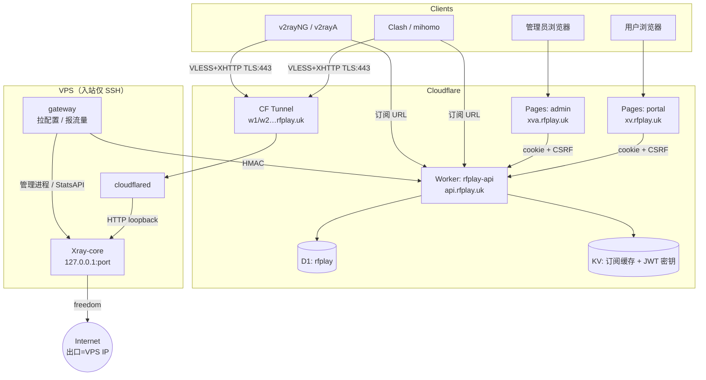

# Airport Proxy System Architecture Design Plan

> **状态（2026-09-24）**：以当前实现 + 目标终态为准。细节实现见 [cloudflare_migration_plan.md](cloudflare_migration_plan.md)、[docs/xhttp-cloudflare-design.md](docs/xhttp-cloudflare-design.md)、代码。  
> **版本**：v0.1.1（里程碑 A 验收 + **Bug fix** 已合入；支付暂缓）。

---

## 1. 概述与目标 / Overview & Goals

**rfplay.uk** 是代理订阅平台：控制面全部在 Cloudflare；节点为自有 VPS（Xray 官方二进制 + **gateway**）；用户自备通用客户端导入订阅 URL。

| 目标 | 说明 |
| :--- | :--- |
| 控制面无 VPS | Worker API + D1 + Pages；无自建 Go Manager |
| 入站隐藏源站 | 客户端 → CF TLS:443 → Tunnel → `127.0.0.1` 上的 Xray |
| 出口不隐藏 | 目标站看到的是 **VPS 公网 IP**（`freedom` 直连） |
| 协议 | **VLESS**（可选 VMess）+ **XHTTP** + TLS；无 Reality；无 WS 产品路径 |
| 客户端 | Clash / mihomo（主推）、v2rayNG、v2rayA；无自研 App |
| 节点代理 | 官方 Xray-core（当前 pin ≥ v26.3.27）；**不**魔改 fork |
| 资格管控 | 到期 / 超额 / 封禁后订阅与节点用户列表同步剔除 |

---

## 2. 系统上下文 / System Context



**数据流摘要**

| 路径 | 说明 |
| :--- | :--- |
| 用户 | Portal 注册/登录 → 复制订阅 URL → 客户端拉取 → 经 CF 连节点 |
| 管理 | Admin 建节点、开通商品、改用户资格 |
| 节点 | gateway 定时 `GET …/config` → 重载 Xray；`POST …/traffic/report` 记账 |
| Cron | Worker 每小时：标记过期、按 30 天周期重置流量；JWT 签名密钥按日轮换（见 §7） |

---

## 3. 组件 / Components

| 组件 | 路径 / 域名 | 职责 |
| :--- | :--- | :--- |
| **Worker API** | `workers/api/` → `api.rfplay.uk` | Hono：`public` / `auth` / `oauth` / `client` / `web` / `admin` / `node`；D1 + KV；Cron |
| **Portal** | `portal/` → `xv.rfplay.uk` | Vue 3：登录/注册（密码+可选 Google）、Dashboard（套餐+设备+订阅） |
| **Admin** | `admin/` → `xva.rfplay.uk` | Vue 3：用户/商品/节点/订单；一键复制 Base64/Clash 订阅 URL |
| **gateway** | `gateway/`（原 rfplay-daemon） | Pull 配置、管理 Xray、Stats 读流量并 HMAC 上报 |
| **Xray** | VPS `/usr/local/bin/xray` | 官方二进制；inbound 仅 `127.0.0.1`；`network=xhttp`，`security=none` |
| **CF Tunnel** | cloudflared | `w1.rfplay.uk` 等 → `http://127.0.0.1:<nodes.port>`；橙云 CNAME，无源站 IP |

**节点唯一形态（目标 / 生产）**

| 项 | 客户端侧 | VPS 侧 |
| :--- | :--- | :--- |
| 地址:端口 | 节点域名:`443` | `listen=127.0.0.1`，端口 = `nodes.port` |
| 安全 | `security=tls`，SNI/host = 域名 | `security=none`（TLS 在 CF 终结） |
| 传输 | XHTTP，`mode=packet-up`，`alpn=h2` | 同 path（`ws_path` 列，建议 `/rfhttp/`） |
| 协议 | VLESS（主）/ VMess | 同上 |

> `network` 仅 `xhttp`（存量 `ws` 等读配置时 coerce）；`reality_*` 列停用。

**Bindings / Secrets（Worker）**

| 类型 | 名称 | 用途 |
| :--- | :--- | :--- |
| D1 | `DB` / `rfplay` | 业务库 |
| KV | `CACHE` | 订阅响应缓存 ~60s；JWT 活密钥 `jwt:current` / `jwt:previous` |
| R2 | `BACKUPS` | 已绑定，备份未接 |
| Secret | `JWT_SECRET` | 会话 **bootstrap / 兜底**（轮换后活密钥在 KV） |
| Secret | `TURNSTILE_SECRET` | 人机 siteverify（登录/注册；OAuth 回调不校验） |
| Secret | `GOOGLE_CLIENT_ID` / `GOOGLE_CLIENT_SECRET` | 可选；Portal Google 登录 |
| Vars | `PORTAL_URL`、`COOKIE_DOMAIN` 等 | 见 `.env.example` |
| Pages | `VITE_TURNSTILE_SITE_KEY`、`VITE_GOOGLE_CLIENT_ID` | 构建注入 |

---

## 4. 数据模型 / Data Model（D1 要点）

迁移：`workers/api/migrations/0001`–`0006`（`0005` XHTTP-only；`0006` `google_sub`）。

### users

| 字段 | 说明 |
| :--- | :--- |
| `username`, `password_hash`, `role`, `status` | 认证与账号状态；登录可用**用户名或邮箱** |
| `email` | 唯一（大小写不敏感）；Google 绑定与资料 |
| `google_sub` | 可选 UNIQUE；Google OAuth subject |
| `client_token` | 订阅路径 token（`/links/:token`） |
| `vless_uuid` | 节点与订阅共用 UUID |
| `subscription_status`, `expire_time` | active / pending / expired… |
| `traffic_limit_bytes`, `traffic_used_bytes`, `traffic_period_start` | 流量与 30 天周期 |
| `rate_limit_bps` | 商品字段保留；**不下发节点**（Xray 无按用户限速） |
| `token_version` | 吊销会话 |
| `max_devices` | 设备槽（默认 5） |
| `phone` / `display_name` / `billing_address` | 资料 |

资格判定（订阅 + 节点用户列表共用）：`ACCOUNT_DISABLED` / `SUBSCRIPTION_PENDING` / `SUBSCRIPTION_EXPIRED` / `TRAFFIC_EXCEEDED`。

### nodes

| 字段 | 说明 |
| :--- | :--- |
| `name`, `address`, `port`, `protocol` | 展示名、域名、本机端口、`vless`/`vmess` |
| `network`, `ws_path` | 生产 `xhttp` + path；`port` 仅 loopback |
| `token` | gateway 凭证 `nd_…` |
| `status`, `last_heartbeat` | active 才下发用户；心跳由拉配置/上报更新 |
| `traffic_up/down` | 节点累计 |
| `security`, `reality_*` | **停用** |

### products / orders / traffic_records / user_devices

- **products**：`duration_days`、`traffic_bytes`（每 30 天额度）、`speed_limit_bps`、`currency`、`max_devices`
- **orders**：下单骨架保留；支付回调为里程碑 B
- **traffic_records**：按节点/用户增量明细
- **user_devices**：订阅侧设备指纹槽位

---

## 5. 节点同步与流量协议 / Node Sync & Traffic

**鉴权**：每个请求带 `X-Node-Timestamp`、`X-Node-Signature`。

```
key = SHA256("rfplay-node-hmac-v1:" + node_token)
msg = METHOD + "\n" + path + "\n" + ts + "\n" + body
sig = hex(HMAC-SHA256(key, msg))
时钟容差 ±300s；验签失败统一 401
```

### GET `/api/v1/node/:token/config`

响应：`{ node_id, name, protocol, config }`

- `config`：完整 Xray JSON；用户 email = `u{id}`（Stats 归因）；仅 **可服务** 用户
- `_meta.version`：FNV 指纹（传输 + 用户集合）；不变则 gateway 跳过重载
- `_meta.api_port`：StatsService（默认 10085）
- 节点非 active → **空用户列表**（不断开 gateway，下一周期踢光连接），非 403
- 成功记 `last_heartbeat`

### POST `/api/v1/node/:token/traffic/report`

Body：`{ node_id?, traffic: [{ user_id, upload_bytes, download_bytes }] }`

- gateway 从 `xray api statsquery -reset` 读增量，进本地 `pending`；**HTTP 200 后才扣 pending**
- Worker 用 `json_each` 批量写 `traffic_records`、累加 `users.traffic_used_bytes` 与节点计数
- 单次最多 5000 条；同用户合并；未知 user_id 忽略

### gateway 行为要点

- 配置变更：写盘 → `xray run -test` → 重启；失败不标记已应用
- 崩溃指数退避拉起；进程退出时结束 Xray
- 示例配置：`gateway/gateway.example.json`（`manager_url`、`manager_token`、`sync_interval` 纳秒整数）

---

## 6. 订阅格式 / Subscription Formats

基址：`GET /api/v1/client/links/:token`（资格不通过 → 403 + 原因码）

| 路径 | 格式 | 客户端 |
| :--- | :--- | :--- |
| `/links/:token` | Base64 多行 `vless://` / `vmess://` | v2rayNG、v2rayA（需支持 XHTTP 的内核） |
| `/links/:token/clash` | Clash YAML | **Clash Verge / mihomo（主推）** |
| `/links/:token/singbox` | sing-box JSON | **未完成**（portal 入口已下线） |

响应头 `Subscription-Userinfo`：流量与到期。KV 缓存约 60s。

**XHTTP 订阅约定**（与 [docs/xhttp-cloudflare-design.md](docs/xhttp-cloudflare-design.md) 一致）

- 客户端端口固定 **443**，`security=tls`，`alpn=h2`，`mode=packet-up`（URI 另带 `xhttpMode` 兼容 v2rayA ≥2.2.7.5）
- Clash：`network: xhttp` + `xhttp-opts.path/host/mode`

---

## 7. 安全 / Security

| 面 | 机制 |
| :--- | :--- |
| Portal / Admin 会话 | HS256 JWT → httpOnly cookie（`session` / `admin_session` / `refresh`）+ CSRF double-submit；跨站 Bearer 兜底 |
| JWT 密钥轮换 | KV `jwt:current` / `jwt:previous`（`{kid,secret,rotated_at}`）；hourly cron 内若距上次 ≥24h 则轮换；签发用 current（header `kid`）；校验 current→previous（~24h grace，不全局 bump `token_version`）；`JWT_SECRET` 仅首次种子 |
| 吊销 | `token_version`：登出、封禁等 bump；role/status 每次回库校验 |
| 节点 | HMAC（上节）；token 不进日志；非回环 `listen_addr` 拒绝启动 |
| Tunnel | 代理端口不对公网开放；DNS 无源站 IP |
| 边缘 | CF Universal SSL；WAF + Turnstile **non-interactive**（限流不在 Worker 内做） |
| Access | **勿**挂在 `api` / `xva`（Access 302 破坏跨域 CORS）；人机靠 Turnstile |
| Google OAuth | 见 [docs/oauth-google.md](docs/oauth-google.md)；回调写与密码登录相同 cookie |
| Xray 出站 | 路由屏蔽私网/回环，防止经代理打 StatsService |

---

## 8. 部署与运维 / Deploy & Ops

| 面 | 方式 |
| :--- | :--- |
| Worker | `main` → `deploy-worker.yml`：`d1 migrations apply` + `wrangler deploy` |
| Pages | `deploy-pages.yml`：构建后 `wrangler pages deploy` Direct Upload |
| Secrets | `deploy/cloudflare/push-secrets.sh` |
| 节点 | 后台建节点 → 发 `nd_` token → `deploy/node-gateway/deploy-node-gateway.sh` → Tunnel 主机名 |
| 证书 | 无源站证书；CF 边缘 SSL + Tunnel loopback 明文 |
| 回滚 | 重部署上一 Worker；D1 Time Travel（约 30 天） |

**DNS**

| 记录 | 目标 |
| :--- | :--- |
| `xv` / `xva` | Pages（portal / admin） |
| `api` | Worker Custom Domain |
| `w1` / `w2`… | `<tunnel-id>.cfargotunnel.com`（橙云） |

**额度注意**：D1 写以流量上报为主；KV 订阅缓存勿按请求写；JWT 轮换每日最多 2 次 KV 写（current+previous）。

---

## 9. 非目标与暂缓 / Non-goals & Deferred

| 不做 / 暂缓 | 说明 |
| :--- | :--- |
| 自研客户端 / Flutter | 已删除 |
| Go Fiber Manager + SQLite | 已删除 |
| Reality / 直连节点 / 魔改 xray-core | 不做 |
| WS 作为产品传输 | 已下线；admin 拒绝 `network=ws`；读配置时 coerce → xhttp |
| 出口 IP 隐藏 / 中转池 | 明确不做 |
| 支付（BEpusdt / PayPal） | **里程碑 B，暂缓**；现用 Admin `grant` 开通 |
| 按用户限速下发 | Xray 能力不足，推迟 |
| sing-box 订阅完整输出 | 里程碑 C |
| Marzban / 3X-UI | 不引入；自研 gateway + Worker |
| Shadowsocks / Trojan | 已下线 |
| Hysteria2 / gRPC | 不做（XHTTP 已覆盖 Tunnel 场景） |

---

## 10. 待人工运维 / Open Manual Ops

| # | 事项 |
| :--- | :--- |
| 1 | Google OAuth：Console 配 redirect + Worker secrets + Pages `VITE_GOOGLE_CLIENT_ID`（见 [docs/oauth-google.md](docs/oauth-google.md)） |
| 2 | 确认 `JWT_SECRET` 已设（bootstrap）；日常轮换由 cron 写 KV |
| 3 | 新 VPS：Tunnel token + 公共主机名；旧 daemon → `deploy/node-gateway/UPGRADE.md` |
| 4 | 里程碑 B：支付商户与 webhook（暂缓） |
| 5 | 可选：D1 → R2 导出；节点拨测自动 inactive |

---

## 相关文档

| 文档 | 内容 |
| :--- | :--- |
| [README.md](README.md) | 快速入口与目录 |
| [cloudflare_migration_plan.md](cloudflare_migration_plan.md) | 运维清单与 backlog |
| [docs/xhttp-cloudflare-design.md](docs/xhttp-cloudflare-design.md) | XHTTP + Tunnel |
| [docs/devices.md](docs/devices.md) | 设备槽 |
| [docs/oauth-google.md](docs/oauth-google.md) | Google 登录 |
