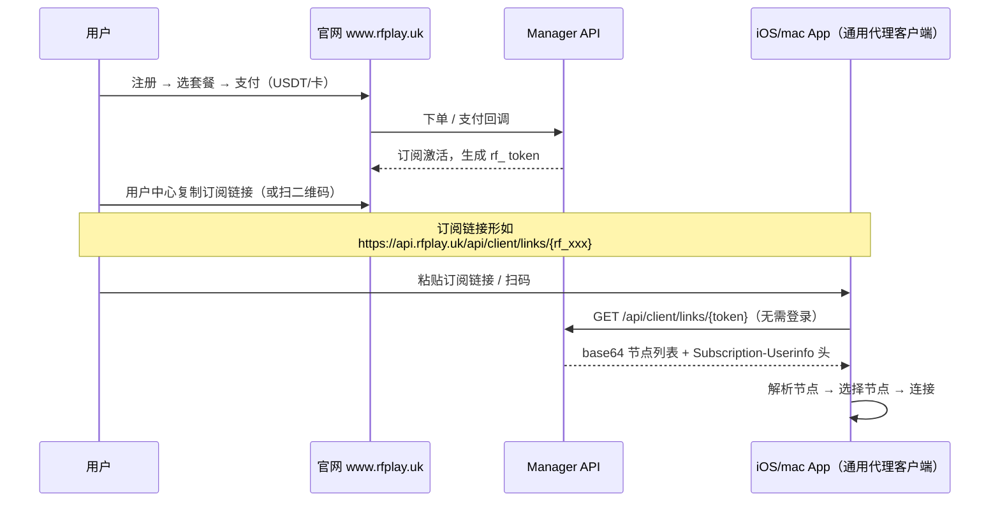

# App Store 上架方案 A — 纯客户端 + 订阅 URL 导入

> **状态**: 已决策（2026-08-06）
> **关联**: [`airport_system_design.md`](airport_system_design.md) §3（Flutter）、§4.4.1（Standard Subscription Format）
> **一句话**: iOS/mac 客户端做成 **Shadowrocket 式通用代理客户端**——App 内零账号、零金流，用户去官网购买订阅，在 App 内粘贴/扫码订阅 URL 导入节点。

---

## 0. 已确认决策（2026-08-06 追加）

| # | 决策 | 说明 |
| :--- | :--- | :--- |
| D1 | **双构建模式** | 同一代码库两种构建：**App Store 版**（`STORE_MODE=true`）= 纯订阅 URL/QR 导入，**连 `token-login` 入口都不暴露**（避免审核抓包发现账号体系）；内测/侧载版 = 完整登录 + token 导入。切换方式：Flutter `--dart-define=STORE_MODE` |
| D2 | **macOS 不上 Mac App Store** | 走 **Developer ID + notarization** 直接分发 dmg（Surge/ClashX 同款路线），个人账号即可，无需 VPN 问卷 |
| D3 | **macOS 优先评估系统代理方案** | 若可行，mac 端走 HTTP/SOCKS5 系统代理 + 系统网络设置，**避开 Network Extension**（沙盒更友好、无需 `personal-vpn` entitlement）；iOS 才必须走 `NEPacketTunnelProvider` |
| D4 | **App Store 版 error 文案中性化** | 订阅失效提示「订阅已失效，请向服务商更新订阅」，**不出现**官网网址 / 续费按钮 / 购买引导 |
| D5 | **后端 `links/:token` 已就绪** | V2ray/Clash/Singbox 端点已实现；需补 `qrcode`（PNG）与 TTL 限流 |

> **审核口径提醒**：App Store 版构建产物里**不得残留**任何指向 `www.rfplay.uk` 的购买/续费/官网跳转字符串，也不得调用 `/api/auth/*`（含 `token-login`）。

---

## 1. 背景与目标

iOS/mac VPN App 上架的硬约束：

| 约束 | 内容 | 影响 |
| :--- | :--- | :--- |
| **VPN 问卷** | 使用 Network Extension 的 App 必须声明为 VPN App，并提供**服务营业国家/地区的合法 VPN 业者登记或执照** | 自营机场（注册+付费+自有节点）会被认定为"VPN 服务商" |
| **3.1.1 IAP** | App 内卖数字订阅必须走 StoreKit，Apple 抽 30% | 自建订单/支付体系在 App Store 版里不可用 |
| **引导外部支付红线** | App 内出现"去官网购买/续费"入口 = 引导用户绕开 IAP → 下架（ExpressVPN 先例） | 登录态 + 续费按钮的组合是最常见的拒审点 |
| **账号体系** | 有注册/登录 = SaaS 审查（隐私政策、账号删除等全套要求） | 登录入口越多，审查面越大 |

**方案 A 的目标**：把客户端与"服务商"身份彻底解耦——App 只是**通用代理工具**，卖的是订阅服务本身（在官网完成），从而绕开上述所有红线。

## 2. 方案 A 核心原则（Decided）

| # | 原则 | 具体含义 |
| :--- | :--- | :--- |
| 1 | **App 内零账号** | 无注册、无登录、无个人中心。App 不认识用户是谁 |
| 2 | **App 内零金流** | 无购买、无套餐、无支付、无续费按钮、无"打开官网续费"提示 |
| 3 | **通用代理客户端定位** | 可导入**任意**订阅 URL / 任意节点链接（`http(s)://`、`ss://`、`vmess://`、`vless://`、`trojan://`、`hysteria2://`、`tuic://`），不只自家机场——这是 Shadowrocket/Quantumult X 能过审的本质 |
| 4 | **订阅全部走 URL/QR** | 用户去官网购买 → 复制订阅 URL 或扫二维码 → 在 App 粘贴/扫码导入 |
| 5 | **账号体系全在网页端** | 注册、登录、套餐、支付、订单、流量查询、设备管理全部在 `www.rfplay.uk`（已有） |

> **与方案 C 的界限**：方案 A 的 App **不显示登录入口**，也不显示官网购买入口。只保留"订阅已失效，请前往服务商网站更新订阅"这类中性错误提示。任何把用户往自家官网引导购买/续费的 UI 都会滑向方案 C 的高风险区。

## 3. 产品边界（App 有 / 没有）

| 功能 | App（方案 A） | 官网 Portal |
| :--- | :--- | :--- |
| 注册 / 登录 | ❌ 无 | ✅ |
| 购买 / 支付 / 续费 | ❌ 无 | ✅ |
| 订阅 URL / QR 导入 | ✅ 核心功能 | ✅ 用户中心复制订阅链接 + 二维码 |
| 节点列表 / 手动添加节点链接 | ✅ | ❌ |
| 连接 / 断开 / 自动分流 | ✅ | ❌ |
| 流量 / 到期信息展示 | ✅（从订阅响应头 `Subscription-Userinfo` 解析，**只读展示**） | ✅ |
| 设备管理 / Token 重生成 | ❌（引导到官网，或直接不做） | ✅ |
| 到期提醒 | ✅（仅本地提示，无跳转购买） | ✅ |

## 4. 用户旅程



**关键点**：App → API 的订阅拉取**不需要 JWT、不需要登录态**，靠 URL 路径里的 `rf_` token（§4.4.1 已定义）。App 甚至可以理解成"导入了一个第三方订阅链接"。

## 5. 与现有架构的关系（改动点）

### 5.1 后端 Manager — 基本已具备

| 端点 | 状态 | 说明 |
| :--- | :--- | :--- |
| `GET /api/client/links/:token` | ✅ 已实现 | `subscription.go` → v2ray base64 |
| `GET /api/client/links/:token/clash` | ✅ 已实现 | Clash YAML |
| `GET /api/client/links/:token/singbox` | ✅ 已实现 | Sing-box JSON |
| `GET /api/client/links/:token/qrcode` | ⚠️ **stub** | `subscription.go:424` 是占位，需用 `rsc.io/qr` 真正生成 PNG |
| 订阅速率限制 | ⚠️ 需加固 | `linkRateLimiters` 是无限增长的 `sync.Map`（代码里 TODO），换 TTL LRU |

### 5.2 Flutter 客户端 — 导入能力已有，需调整入口

已存在：
- `screens/subscription/input_page.dart` — 订阅 URL 粘贴 + 节点链接粘贴
- `screens/subscription/qr_scanner_page.dart` — 扫码
- `services/subscription_service.dart` — `importFromUrl()` / `importFromLink()` 已实现 base64 解码 + URI 解析

需要改：
1. **App Store 构建形态 = 纯导入模式**：用 `--dart-define=APPCENTER=appstore` 或 Flutter build flavor 切换入口——App Store 版**首屏就是订阅导入页**，隐藏登录/注册/账号相关页面；内测/侧载构建保留登录模式（方案 B/C 或自用）。
2. 导入成功后的主页：节点列表 + 连接（现有 `vpn_screen.dart` / `xray_engine.dart` 复用）。
3. 展示流量/到期：解析 `Subscription-Userinfo` 头（`download/total/expire`），**只读**，不附带任何"去续费"动作。
4. 订阅失效（401/403）→ 提示"订阅已失效，请前往服务商网站更新订阅链接"，**不弹官网 URL**。

### 5.3 iOS / macOS 工程配置

| 项目 | 当前状态 | 需要做 |
| :--- | :--- | :--- |
| iOS entitlements | ❌ 无 `Runner.entitlements` | 新建并添加 `com.apple.developer.networking.vpn.api.personal-vpn`；在 Signing & Capabilities 勾选 **Network Extensions** |
| macOS entitlements | 仅 app-sandbox（`Release.entitlements` / `DebugProfile.entitlements`） | 添加 `com.apple.security.network.client`；如用 NetworkExtension 再加 VPN entitlement（mac 走 Developer ID 分发则无需 App Store 问卷） |

**iOS entitlements（Runner.entitlements）参考**：

```xml
<dict>
    <key>com.apple.developer.networking.vpn.api.personal-vpn</key>
    <true/>
</dict>
```

## 6. 上架准备

### 6.1 账号与签名

| 端 | 方案 A 发行方式 | 签名 |
| :--- | :--- | :--- |
| **iOS** | App Store（个人开发者 $99 即可） | Distribution + Provisioning（含 Network Extensions） |
| **macOS** | **Developer ID + 公证（notarization）直接发 dmg**，不上 Mac App Store | Developer ID Application 证书 + notary |

macOS 不需要过 App Store 审核，用 Developer ID 分发即可（Surge/ClashX 都是这个路子），个人账号完全够。

### 6.2 App Store Connect

- **VPN 问卷**（VPN Configuration 声明）：如实勾选 "VPN"，用途填"隐私保护 / 网络代理工具"。问卷要求服务营业地区合法登记——**方案 A 的答辩口径**：App 是通用代理客户端，本身不提供服务，用户自行配置订阅/服务器。
- **隐私政策**：必须有网页版 URL。要点：App 收集的信息（设备型号、系统版本用于连接；不收集浏览记录——实际不记录则如实声明）、第三方共享（无）、删除账号（App 无账号，指向官网账号体系）。
- **分类**：建议 Utilities / 辅助功能。
- **关键词与截图**：避免"机场 / 翻墙 / 科学上网 / GFW"字样；用"代理客户端 / Proxy Client / 网络加速"。

### 6.3 审核风险清单

| 风险 | 方案 A 应对 |
| :--- | :--- |
| 审核员要求说明服务运营资质 | 口径：通用客户端，用户自带订阅；App 内无任何自家服务入口 |
| 被认定"引导绕开 IAP" | App 内无登录、无购买、无官网跳转按钮——切断判定路径 |
| 被认定自营 VPN 服务 | App 不绑定、不预填自家订阅链接；首页默认通用导入 |
| 中国区 | **依然不可行**——中国区 VPN App 一律不审。方案 A 只解决其他区域上架 |

## 7. 回退与演进

| 如果… | 走 |
| :--- | :--- |
| App Store 被拒且无法合理解释 | **方案 B**：App 内登录 + StoreKit IAP 订阅（交 30%，仍需解决 VPN 业者登记） |
| 只想自用/内测 | Ad Hoc / TestFlight / 侧载，保留登录模式 |
| 放弃 App Store | iOS 仅 TestFlight/AdHoc；mac 直接 Developer ID 分发 |

## 8. 任务清单

- [ ] **后端**：`qrcode` 端点用 `rsc.io/qr` 生成真实 PNG（`subscription.go`）
- [ ] 后端：`linkRateLimiters` 换成 TTL LRU（如 `golang-lru/expirable`）
- [ ] 客户端：加 build flavor / `dart-define`，App Store 形态隐藏登录入口，首屏为订阅导入
- [ ] 客户端：订阅失效提示去官网"更新订阅"（中性文案，无购买引导）
- [ ] 客户端：iOS `Runner.entitlements` + Network Extensions capability
- [ ] 客户端：macOS entitlements 补 `network.client`；Developer ID + notarization 脚本
- [ ] 上架：隐私政策页、VPN 问卷、App Store 文案与截图
- [ ] 官网：用户中心"复制订阅链接 + 二维码"按钮（已规划于 §2.2/§3.2，需确认 `Account.vue` 落地）
